**init - used to create a new git repo**

```
git init
git remote add origin <- link ->
git remote -v (to verify remote)
git branch (to check branch)
git branch -M main (to rename branch)
git push origin main
```

```
cd ..
mkdir LocalRepo
```

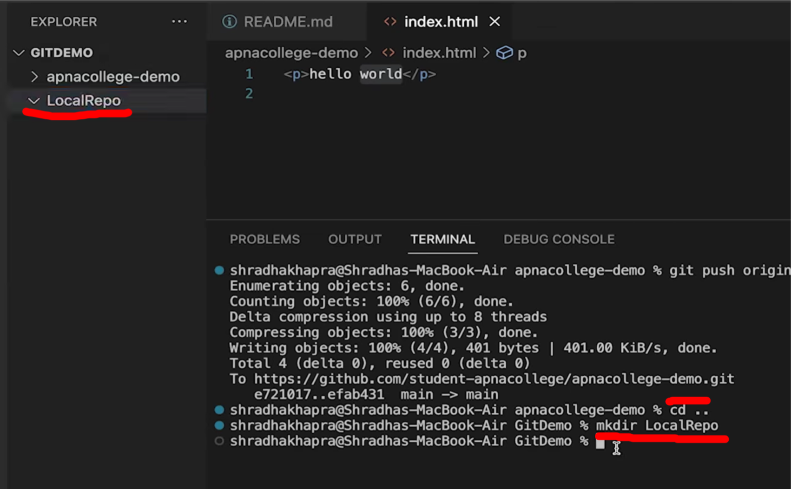

```
cd LocalRepo
```

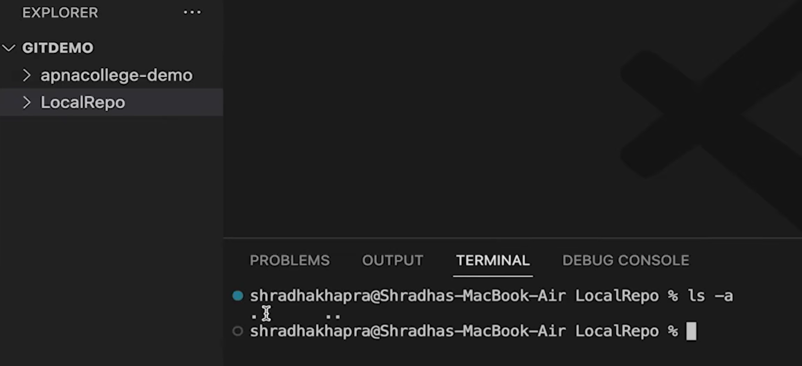
We first have to make it a git repo
we know its not a git repo currently because when we check all the hidden files in the folder we dont find any git file

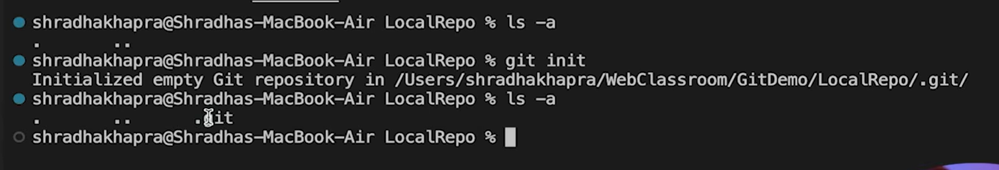

```
git init
```
to initialize git repository

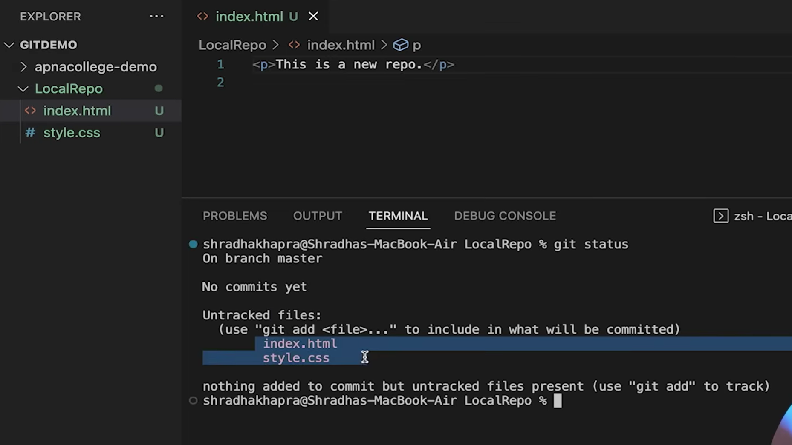
make 2 files and check status

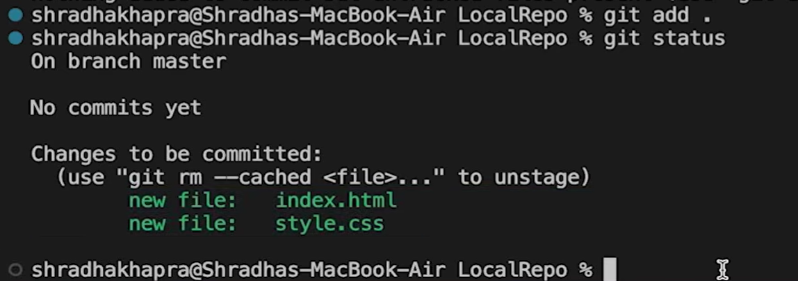

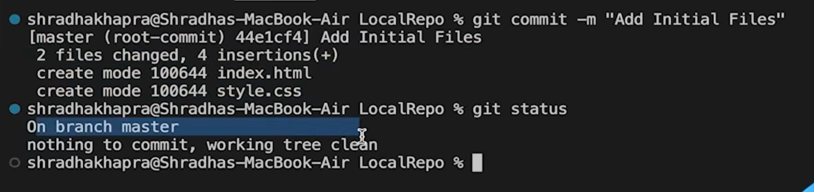
All these changer were made still on Local system

to do that first make a new repo

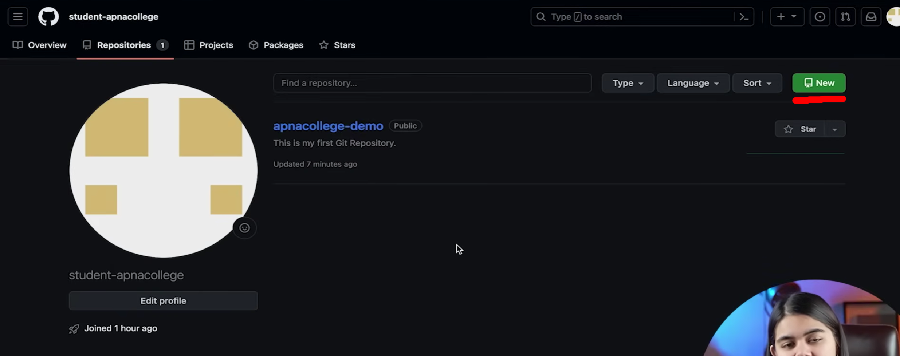

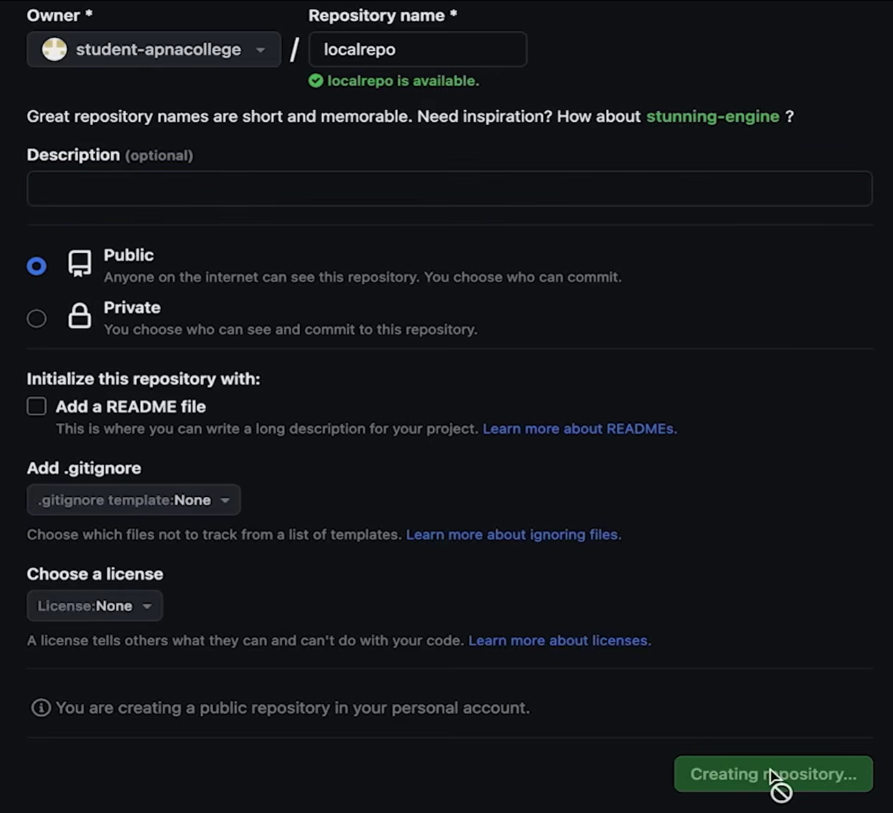

dont initialise readme right now 
because if we do , we have to make it in our local system also


```
git remote add origin <- link ->
```
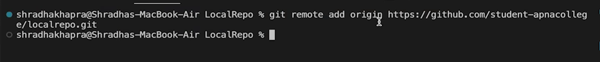
set origin first


```
git remote -v (to verify remote)
```
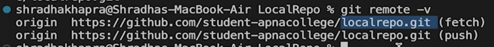
to verify remote


```
git branch (to check branch)
```
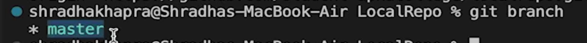


```
git branch -M main (to rename branch)
```


```
git push -u origin main
```
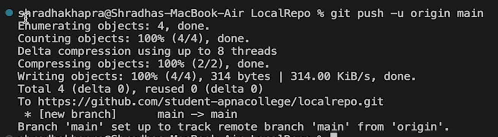
-u to set as primary 
so next time onwards we can just write "git push" and it knows which branch to put into

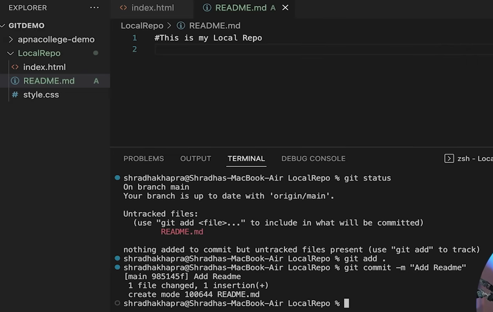

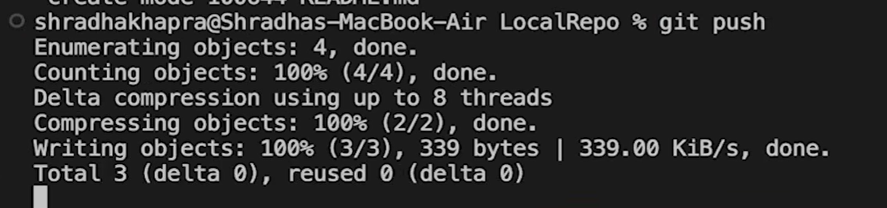

