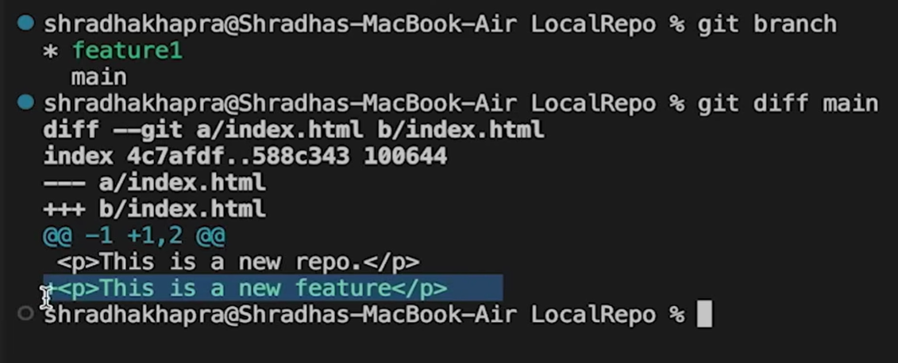

Way 1
```
git diff <- branch name-> (to compare commits, branches, files & more)
git merge <- branch name-> (to merge 2 branches)
```


the new green line shows that the "feature1" branch is ahead of the main branch by this line


Way 2
Create a PR

