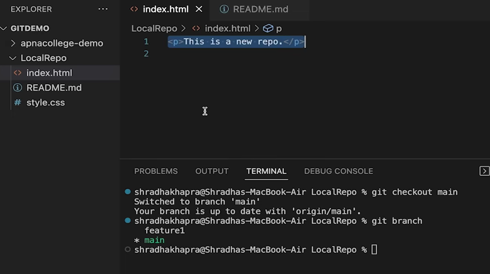
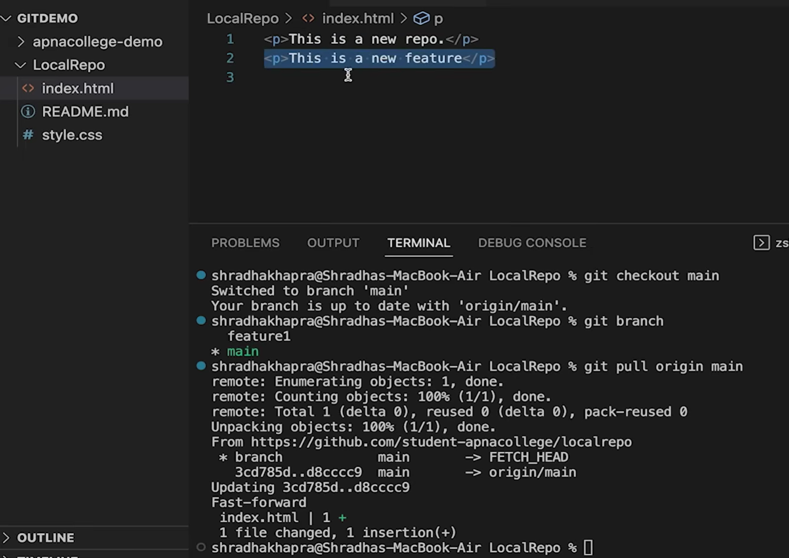

We can see that we merged the changes on github 
but it isnt updated on our local system yet
to do so , we use a pull command

```
git pull origin main
```

used to fetch and download content from a remote repo and immediately update the local repo to match that content.



