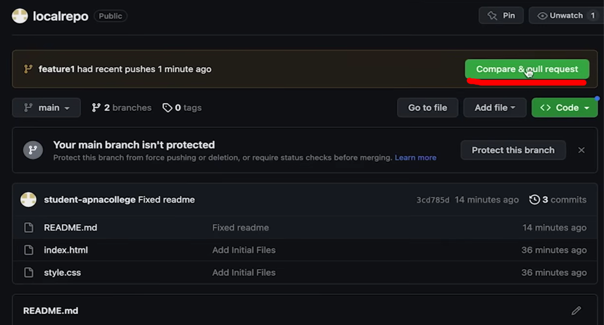
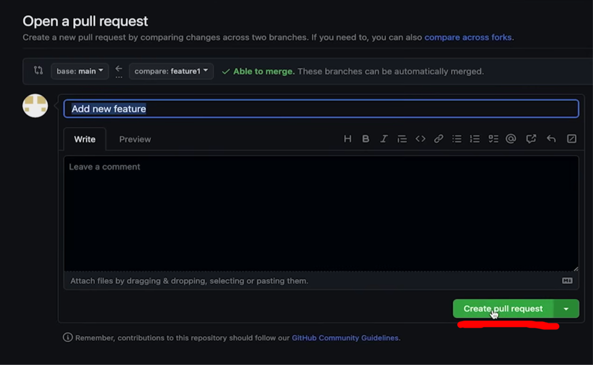
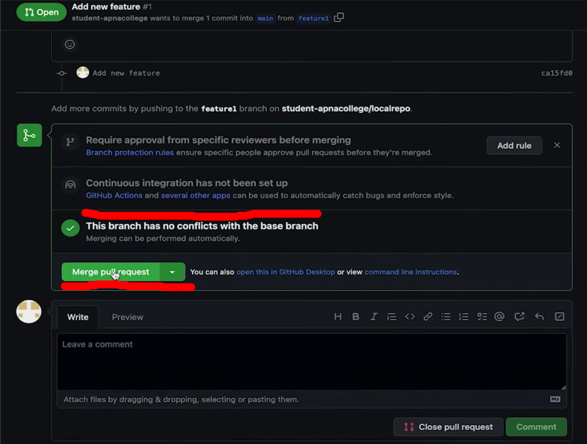
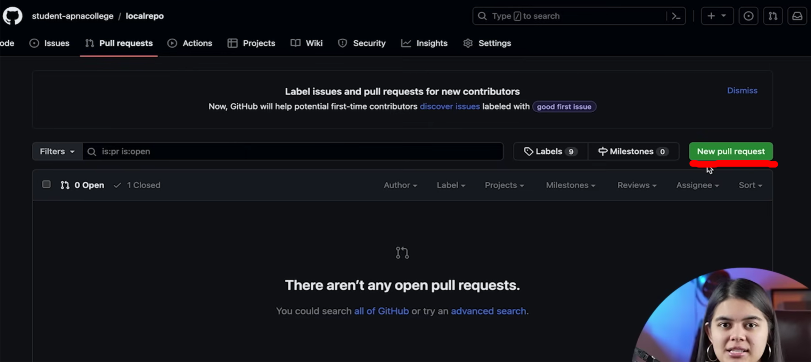

It lets you tell others about changes you've pushed to a branch in a repository on GitHub.

When a lot of developers want to merge with the main branch , 
they do it through a pull request

First we send a request to our manager
He we then review our request
Then it is on the decision of the senior developer to merge it or not

Branch has no conflicts means that 
for ex. we change content of an already present line
but here we had added a new line so no conflict was there

Can make new pull requests from here

