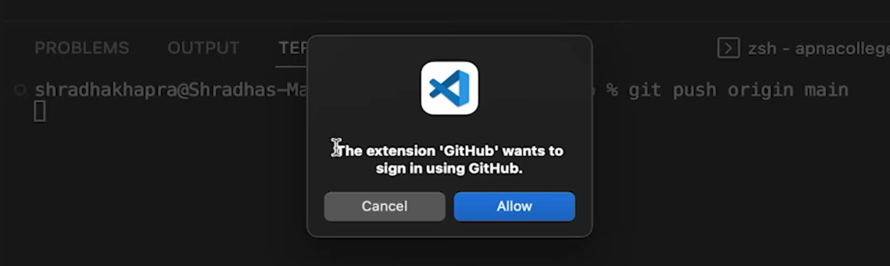
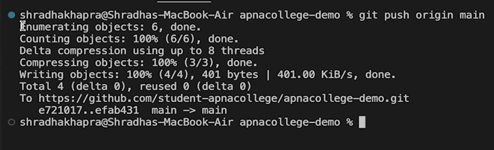
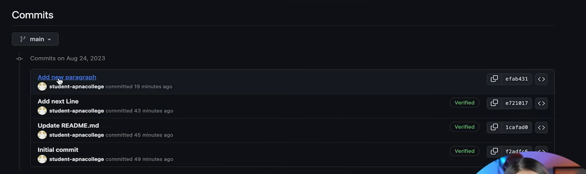
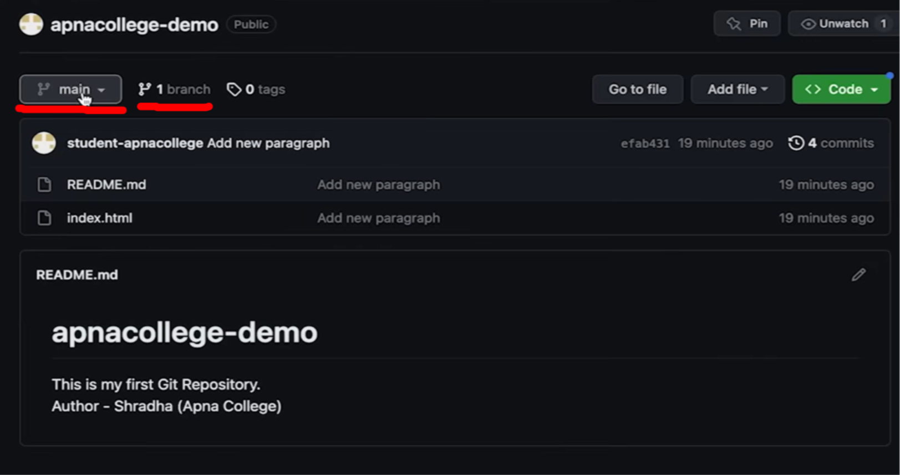

push - upload local repo content to remote repo
```
git push origin main
```






New changes applied




```
git push origin main
```

by default all the repos in GitHub are known as remote repos


here,
origin is the name of the default repo in which we are updating
and main is the name of the branch under which we are updating



