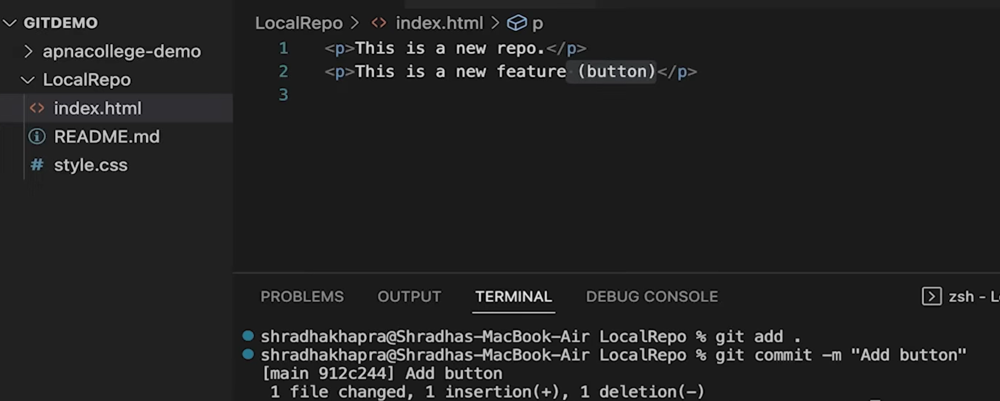
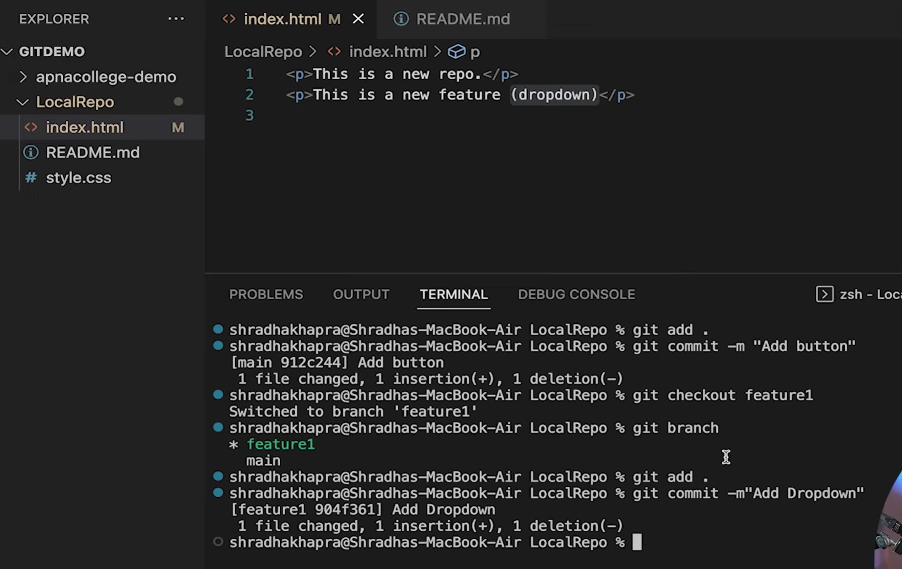
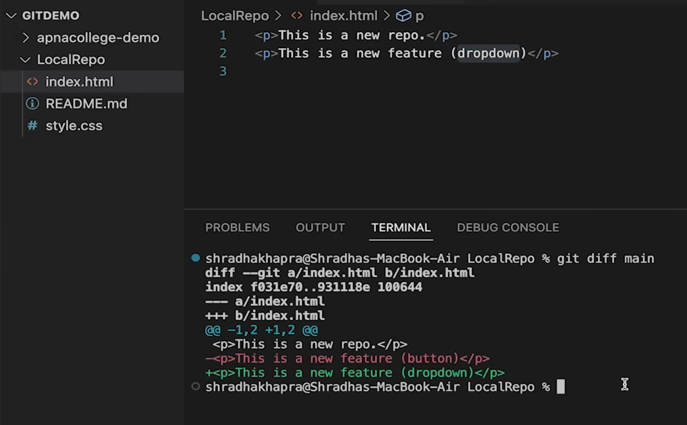
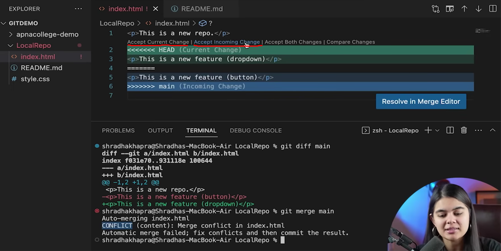
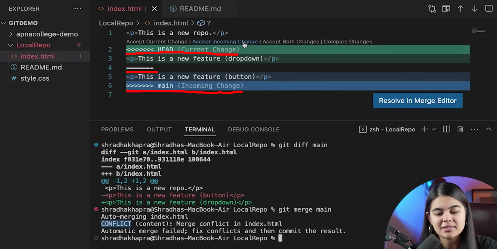
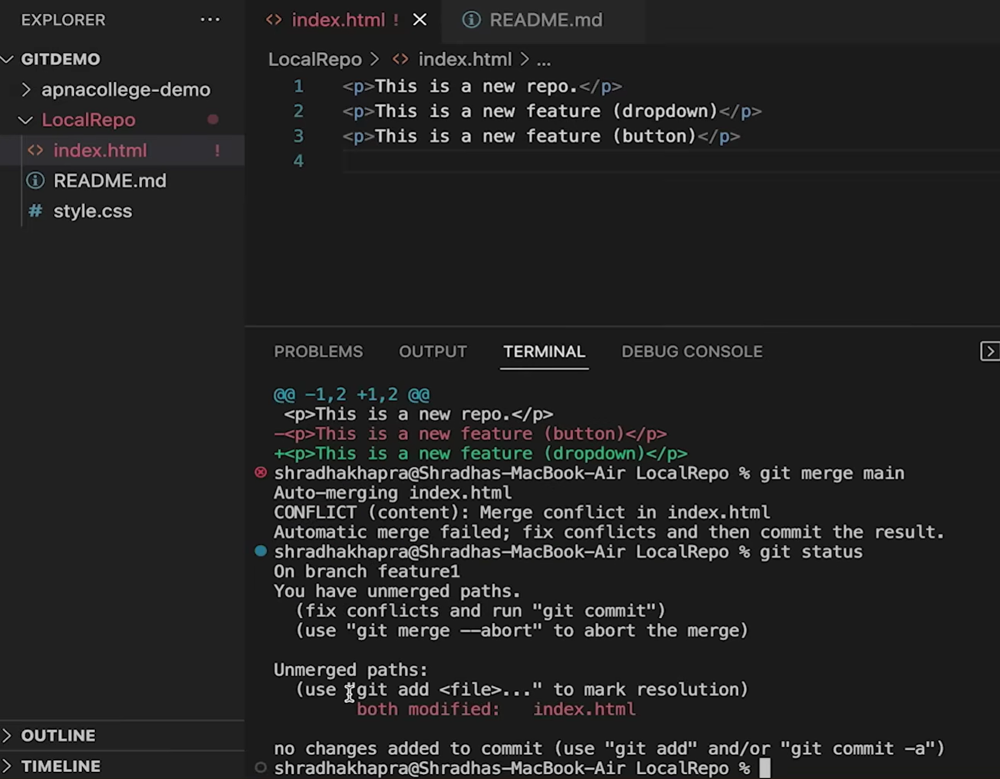
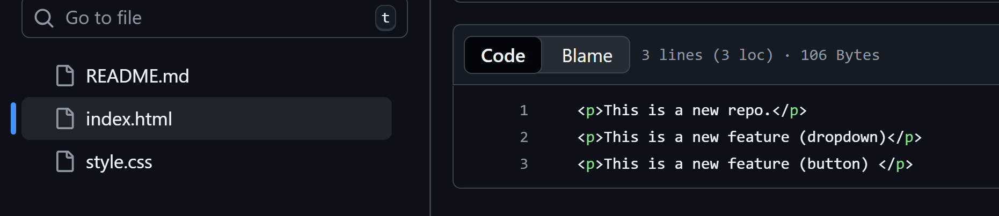

An event that takes place when Git is unable to automatically resolve differences in code between two commits.


In main , this code is there 
we added a "(button)" text and then 'add' and 'commit'


now we switch to 'feature1' branch 
and add 'dropdown' text here
then 'add' and 'push'


now we check the differences between both the branches using
```
git diff main
```


## To merge now


```
git merge main (name of the other branch here to which we want to merge)
```

the vs code will show error now
these are known as conflicts

It gives options to resolve conflicts 


'Accept current change' - the current change/newest change is kept and overwritten on older ones
'Accept incoming change' - the older changes are overwritten on newer ones

in order to manually do , we need to remove the extra lines first which have come



These 3 lines are new and need to be removed

after removing :


now if we save from here , that means we need both of the features

if we remove 1 line and keep other , the other change stays

We keep both in this case and check status :


now add and commit both the features


```
git checkout main
```

When we shift to main branch now , we see that the features from feature1 branch are not since 
since main branch was merged with feature1 and not vice versa

we merge feature 1 with main now 


now we have resolved conflicts 
and now both will be updated on github 




