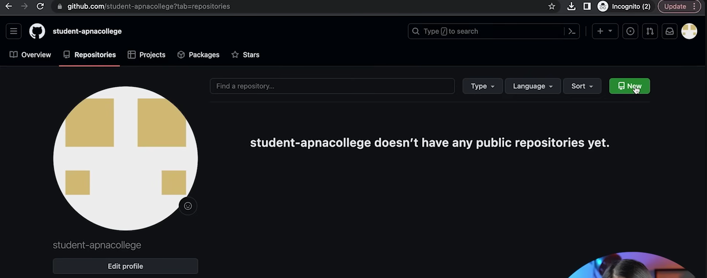
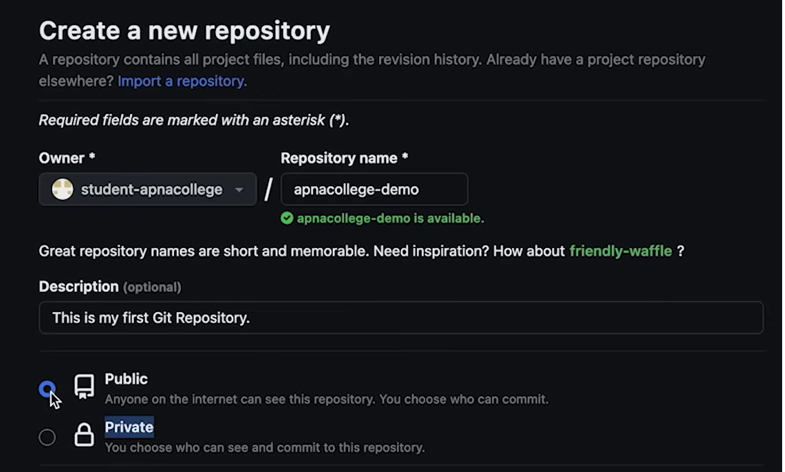
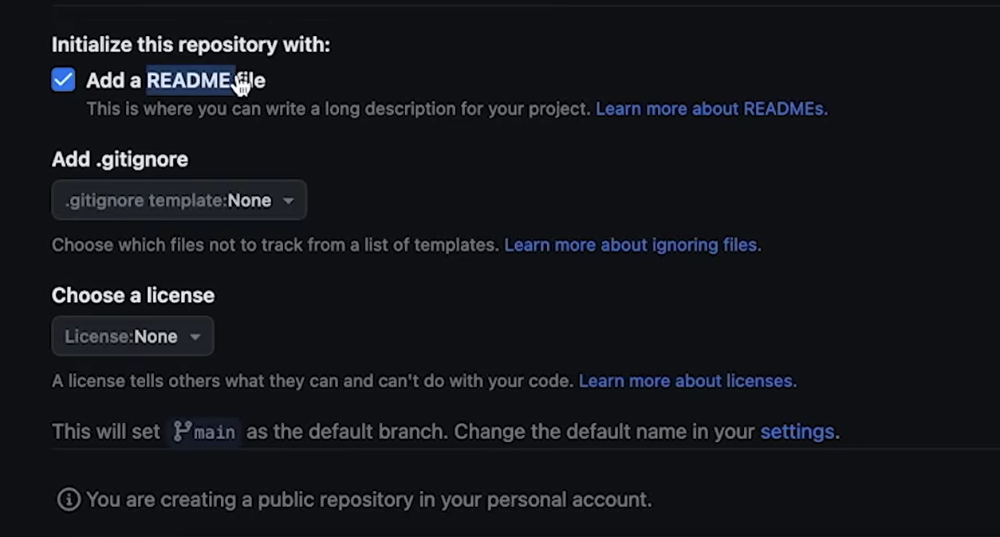
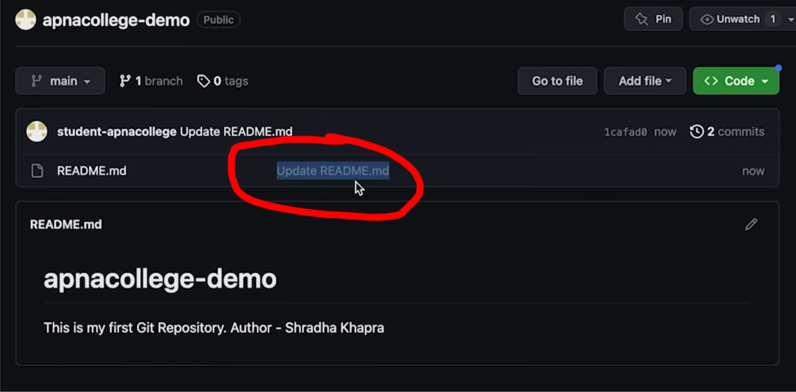

First commit

changes = commit

It is a two step process
1.) add
2.) commit (take a screenshot and save it in memory)

It has changed from "initial commit" to "Update README.md" which we specified

