## Case 1: staged changes ("add" but not "commit")

i.e changed which have been "add" but not "commit"
```
git reset <- file name ->
git reset
```

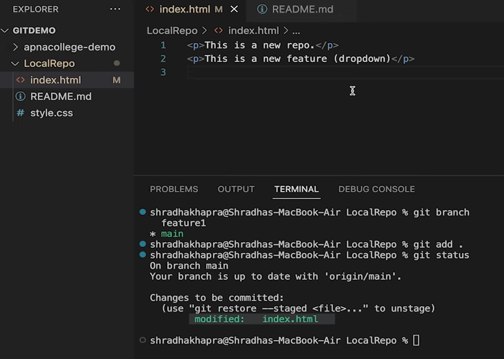
if we delete a line and add it

```
git reset
```

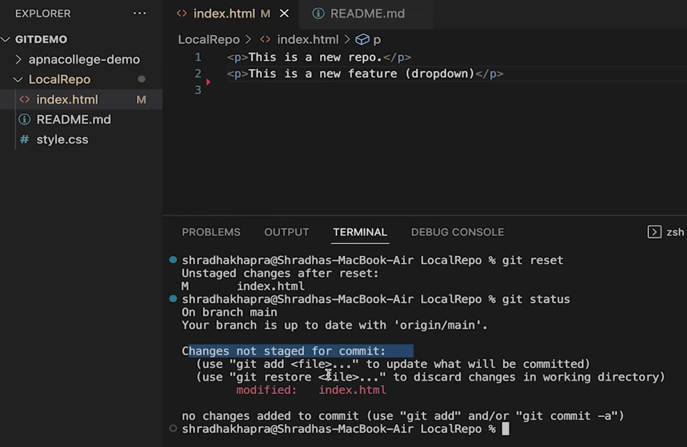

The changes now are removed of 'add'
so we have to first 'add' now then 'commit'

## Case 2: committed changes (for one commit)

```
git reset HEAD~1
```

If we "add" and "commit" both mistakenly
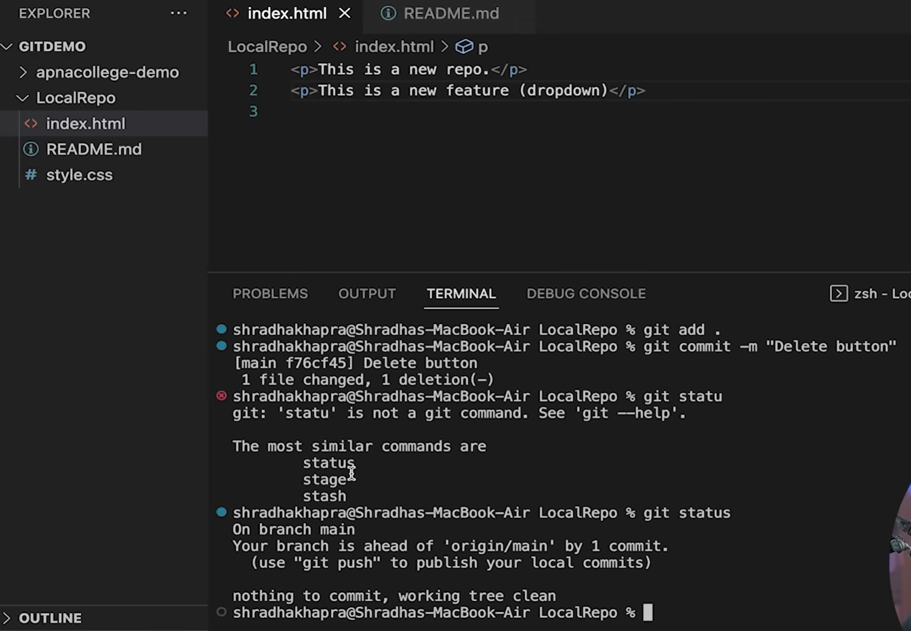

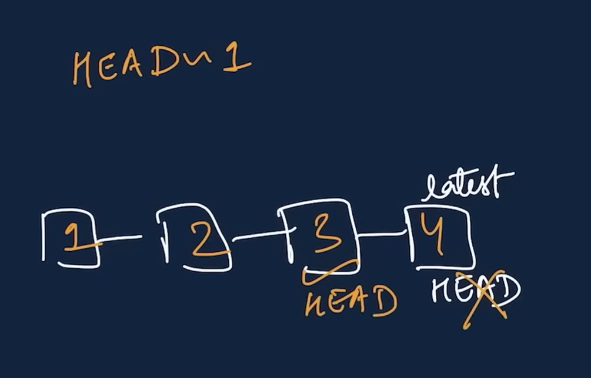
undo change of latest commit
and restore to second last commit

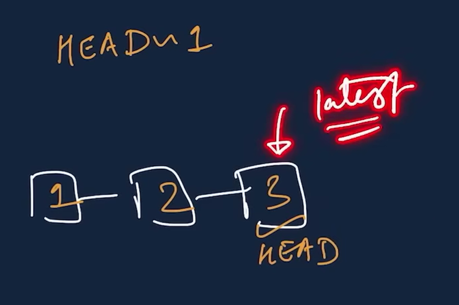
now the old change will become latest change

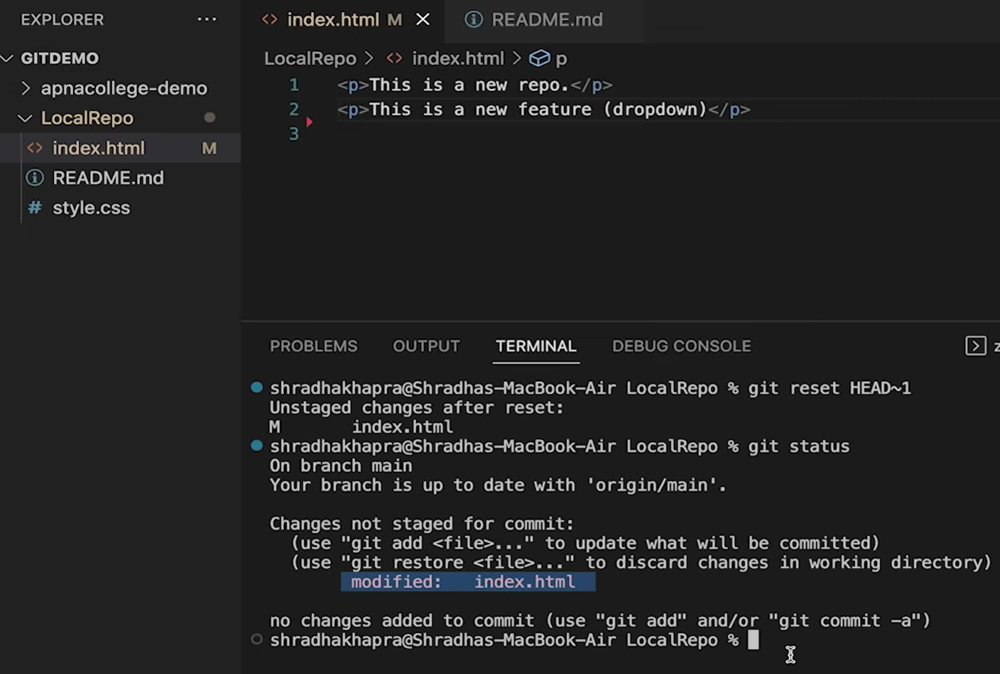
now the change has reset to the stage before "add"

we can use 
```
git log
```
to check the history of commits
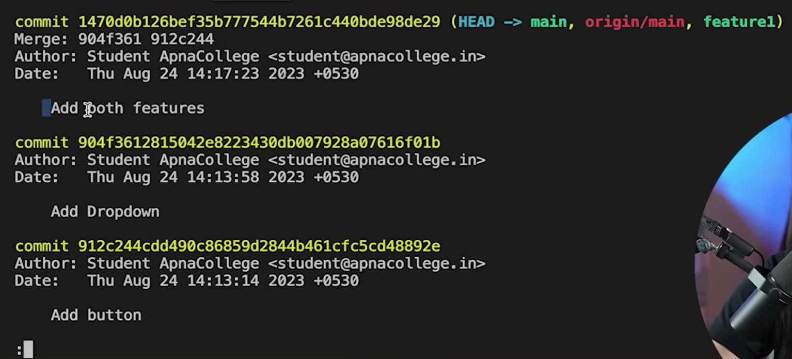
press "q" to quit

## Case 3: committed changes (for many commits)
```
git reset <- commit hash ->
git reset --hard <- commit hash ->
```

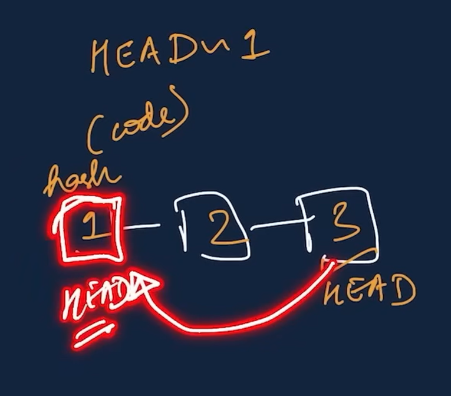
If we don't want to go only 1 commit before 
rather , 'n' number of commits before

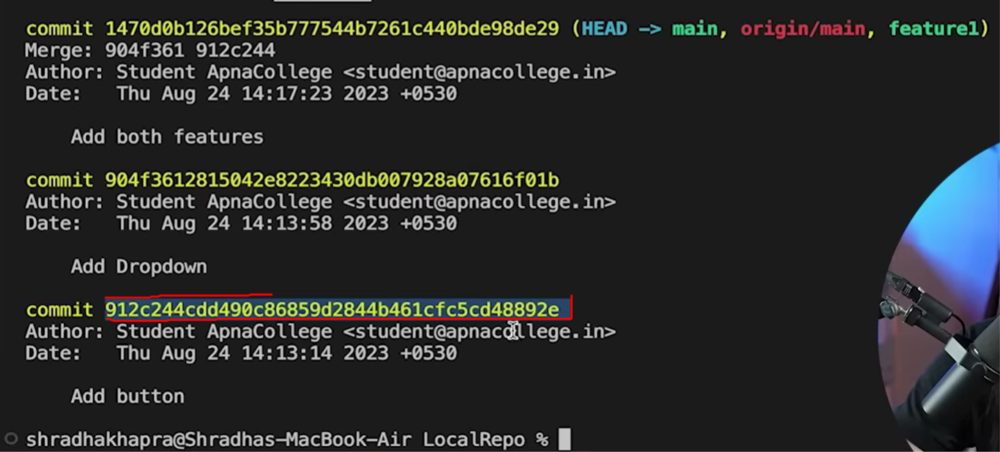

hash of a particular commit can be found using
```
git log
```

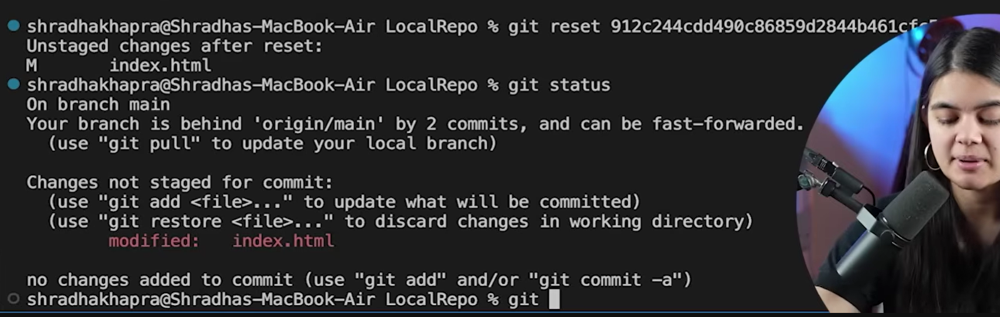

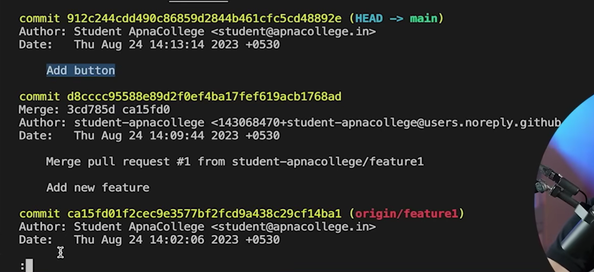

now our "HEAD" has been changed and we have gotten to the mentioned commit


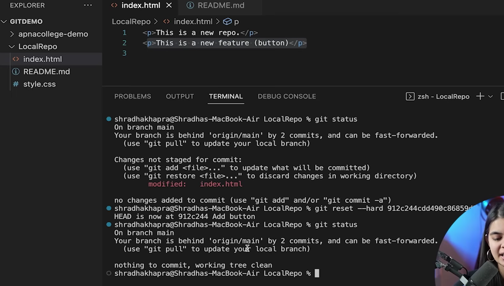

add "--hard" to remove all visible changes from local machine and GitHub after the rest commit

