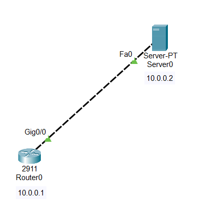
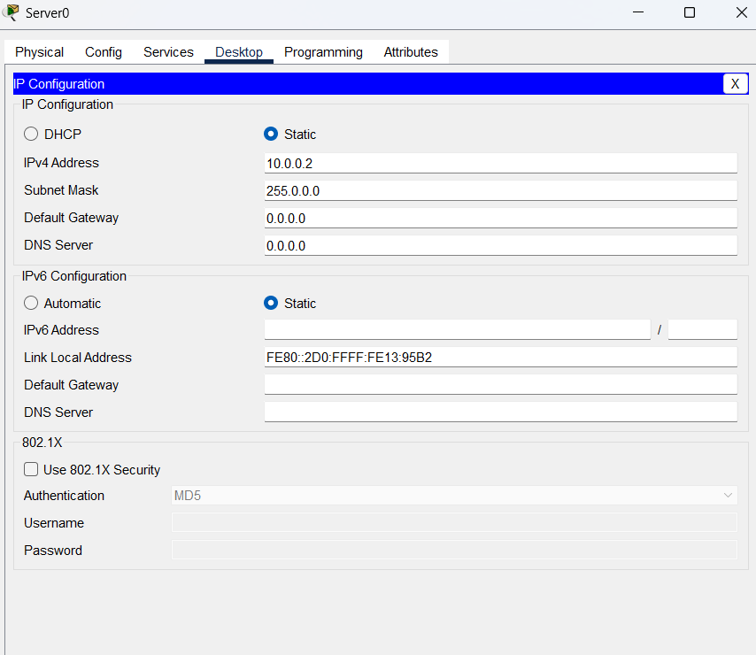
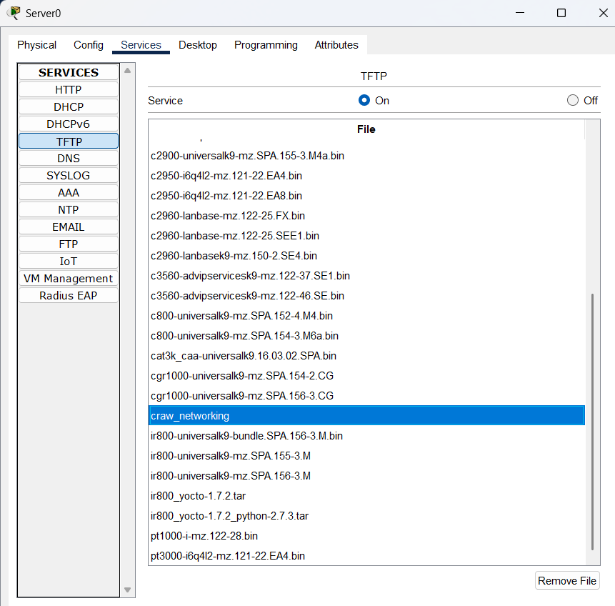

Router\>
Router\>enable
Router#configure terminal
Router(config)#interface gigabitEthernet 0/0
Router(config-if)#ip address 10.0.0.1 255.0.0.0
Router(config-if)#no shutdown
Router(config-if)#ex
Router(config)#

# 
# Copying OS to server

Router#show flash:

System flash directory:
File Length Name/status
3 33591768 c2900-universalk9-mz.SPA.151-4.M4.bin
2 28282 sigdef-category.xml
1 227537 sigdef-default.xml
\[33847587 bytes used, 221896413 available, 255744000 total\]
249856K bytes of processor board System flash (Read/Write)

Router#copy flash: tftp:
Source filename \[\]? c2900-universalk9-mz.SPA.151-4.M4.bin
Address or name of remote host \[\]? 10.0.0.2
Destination filename \[c2900-universalk9-mz.SPA.151-4.M4.bin\]? craw_networking

Writing c2900-universalk9-mz.SPA.151-4.M4.bin....!!!!!!!!!!!!!!!!!!!!!!!!!!!!!!!!!!!!!!!!!!!!!!!!!!!!!!!!!!!!!!!!!!!!!!!!!!!!!!!!!!!!!!!!!!!!!!!!!!!!!!!!!!!!!!!!!!!!!!!!!!!!!!!!!!!!!!!!!!!!!!!!!!!!!!!!!!!!!!!!!!!!!!!!!!!!!!!!!!!!!!!!!!!!!!!!!!!!!!!!!!!!!!!!!!!!!!!!!!!!!!!!!!!!!!!!!!!!!!!!!!!!!!!!!!!!!!!!!!!!!!!!!!!!!!!!!!!!!!!!!!!!!!!!!!!!!!!!!!!!!!!!!!!!!!!!!!!!!!!!!!!!!!!!!!!!!!!!!!!!!!!!!!!!!!!!!!!!!!!!!!!!!!!!!!!!!!!!!!!!!!!!!!!!!!!!!!!!!!!!!!!!!!!!!!!!!!!!!!!!!!!!!!!!!!!!!!!!!!!!!!!!!!!!!!!!!!!!!!!!!!!!!!!!!!!!!!!!!!!!!!!!!!!!!!!!!!!!!!!!!!!!!!!!!!!!!!!!!!!!!!!!!!!!!!!!!!!!!!!!!!!!!!!!!!!!!!!!!!!!!!!!!!!!!!!!!!!!!!!!!!!!!!!!!!!!!!!!!!!!!!!!!!!!!!!!!!!!!!!!!!!!!!!!!!!!!!!!!!!!!!!!!!!!!!!!!!!!!!
\[OK - 33591768 bytes\]

33591768 bytes copied in 3.36 secs (1049701 bytes/sec)
Router#
# 

# Copy server to device

Router#copy tftp: flash:
Address or name of remote host \[\]? 10.0.0.2
Source filename \[\]? craw_networking
Destination filename \[craw_networking\]?

Accessing tftp://10.0.0.2/craw_networking...
Loading craw_networking from 10.0.0.2: !!!!!!!!!!!!!!!!!!!!!!!!!!!!!!!!!!!!!!!!!!!!!!!!!!!!!!!!!!!!!!!!!!!!!!!!!!!!!!!!!!!!!!!!!!!!!!!!!!!!!!!!!!!!!!!!!!!!!!!!!!!!!!!!!!!!!!!!!!!!!!!!!!!!!!!!!!!!!!!!!!!!!!!!!!!!!!!!!!!!!!!!!!!!!!!!!!!!!!!!!!!!!!!!!!!!!!!!!!!!!!!!!!!!!!!!!!!!!!!!!!!!!!!!!!!!!!!!!!!!!!!!!!!!!!!!!!!!!!!!!!!!!!!!!!!!!!!!!!!!!!!!!!!!!!!!!!!!!!!!!!!!!!!!!!!!!!!!!!!!!!!!!!!!!!!!!!!!!!!!!!!!!!!!!!!!!!!!!!!!!!!!!!!!!!!!!!!!!!!!!!!!!!!!!!!!!!!!!!!!!!!!!!!!!!!!!!!!!!!!!!!!!!!!!!!!!!!!!!!!!!!!!!!!!!!!!!!!!!!!!!!!!!!!!!!!!!!!!!!!!!!!!!!!!!!!!!!!!!!!!!!!!!!!!!!!!!!!!!!!!!!!!!!!!!!!!!!!!!!!!!!!!!!!!!!!!!!!!!!!!!!!!!!!!!!!!!!!!!!!!!!!!!!!!!!!!!!!!!!!!!!!!!!!!!!!!!!!!!!!!!!!!!!!!!!!!!!!!
\[OK - 33591768 bytes\]

33591768 bytes copied in 0.256 secs (13777331 bytes/sec)
Router#
Router#show flash:

System flash directory:
File Length Name/status
3 33591768 c2900-universalk9-mz.SPA.151-4.M4.bin
4 33591768 craw_networking
2 28282 sigdef-category.xml
1 227537 sigdef-default.xml
\[67439355 bytes used, 188304645 available, 255744000 total\]
249856K bytes of processor board System flash (Read/Write)

Router#

