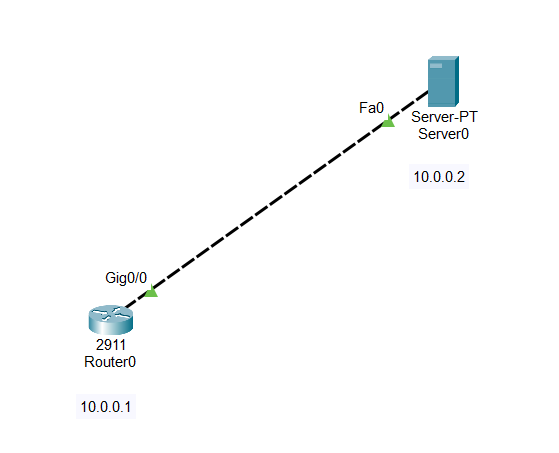
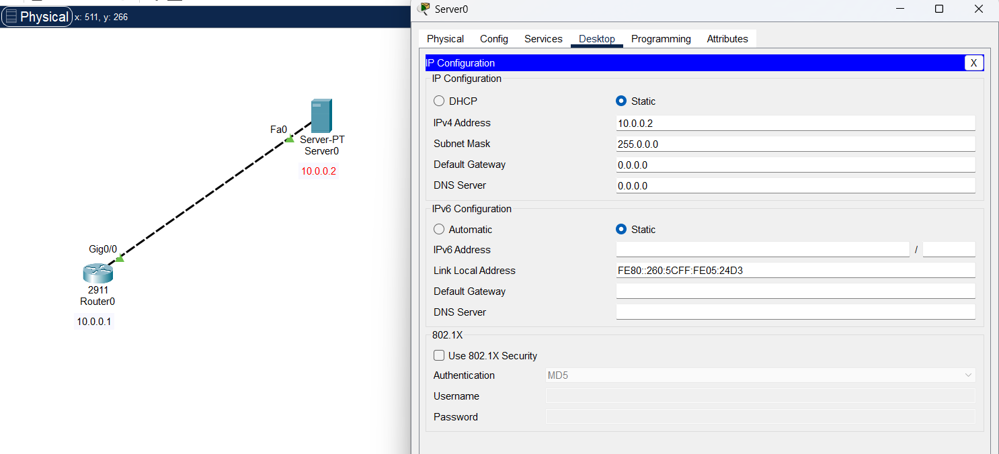
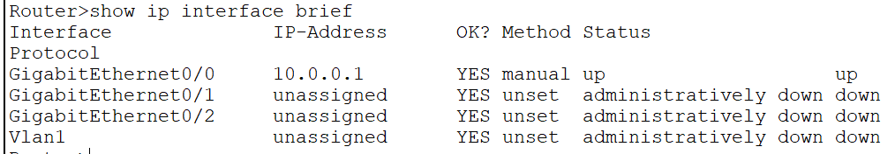
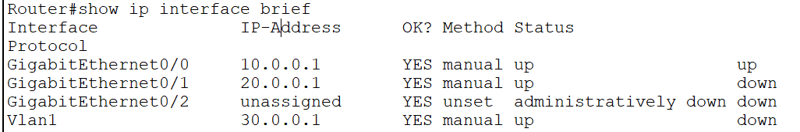
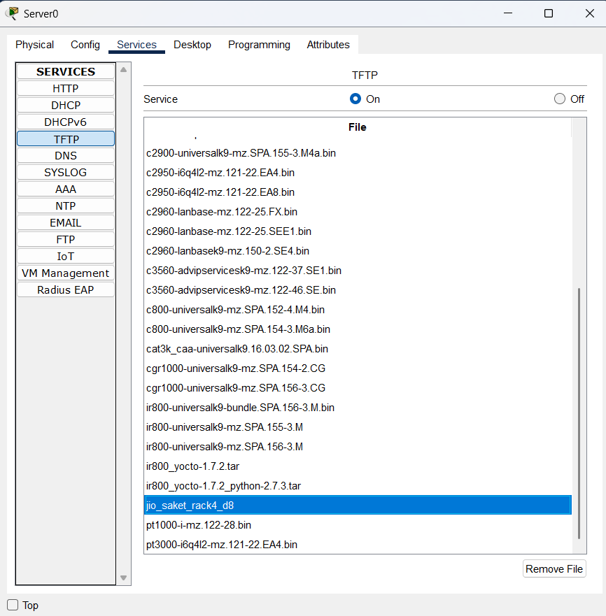
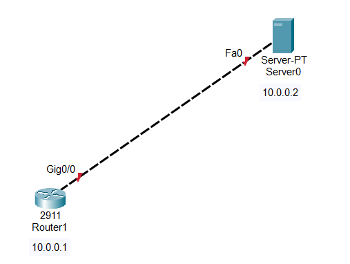
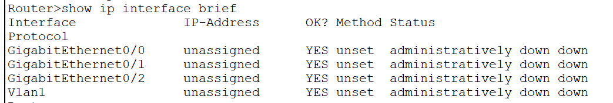

Router\>enable
Router#configure terminal
Router(config)#interface gigabitEthernet 0/0
Router(config-if)#ip address 10.0.0.1 255.0.0.0
Router(config-if)#no shutdown
Router(config-if)#ex
Router(config)#

Router#
Router#configure terminal
Router(config)#interface gigabitEthernet 0/1
Router(config-if)#ip address 20.0.0.1 255.0.0.0
Router(config-if)#no shutdown
Router(config-if)#ex
Router(config)#

Router(config)#
Router(config)#interface vlan 1
Router(config-if)#ip address 30.0.0.1 255.0.0.0
Router(config-if)#no shutdown
Router(config-if)#ex
Router(config)#ex
Router#

Router#
Router#copy running-config tftp:
Address or name of remote host \[\]? 10.0.0.2
Destination filename \[Router-confg\]? jio_saket_rack4_d8

Writing running-config....!!
\[OK - 707 bytes\]

707 bytes copied in 3.004 secs (235 bytes/sec)
Router#

INSTALL NEW ROUTER

Router#
Router#configure terminal
Router(config)#interface gigabitEthernet 0/0
Router(config-if)#ip address 10.0.0.1 255.0.0.0
Router(config-if)#no shutdown
Router(config-if)#ex
Router(config)#ex
Router#

Router#
Router#copy tftp: running-config
Address or name of remote host \[\]? 10.0.0.2
Source filename \[\]? jio_saket_rack4_d8
Destination filename \[running-config\]?

Accessing tftp://10.0.0.2/jio_saket_rack4_d8....
Loading jio_saket_rack4_d8 from 10.0.0.2: !
\[OK - 707 bytes\]

707 bytes copied in 3.002 secs (235 bytes/sec)
Router#

Router#show ip interface brief
Interface IP-Address OK? Method Status Protocol
GigabitEthernet0/0 10.0.0.1 YES manual up up
GigabitEthernet0/1 20.0.0.1 YES manual administratively down down
GigabitEthernet0/2 unassigned YES unset administratively down down
Vlan1 30.0.0.1 YES manual administratively down down
Router#

COPIED ALL THE CONFIGURATION

