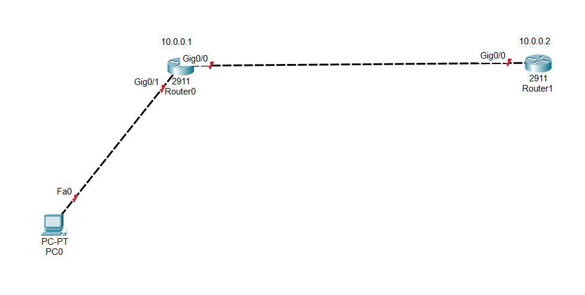
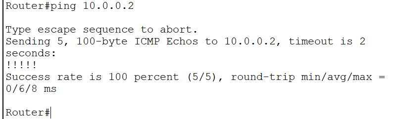

# ROUTER 0

Router\>enable
Router#configure terminal
Router(config)#interface gigabitEthernet 0/0
Router(config-if)#ip address 10.0.0.1 255.0.0.0
Router(config-if)#no shutdown
Router(config-if)#ex
Router(config)#ex
Router#
Router#show ip interface brief
Interface IP-Address OK? Method Status Protocol
GigabitEthernet0/0 10.0.0.1 YES manual up down
GigabitEthernet0/1 unassigned YES unset administratively down down
GigabitEthernet0/2 unassigned YES unset administratively down down
Vlan1 unassigned YES unset administratively down down
Router#

# ROUTER 1

Router\>enable
Router#configure terminal
Router(config)#interface gigabitEthernet 0/0
Router(config-if)#ip address 10.0.0.2 255.0.0.0
Router(config-if)#no shutdown
Router(config-if)#ex
Router(config)#ex
Router#

