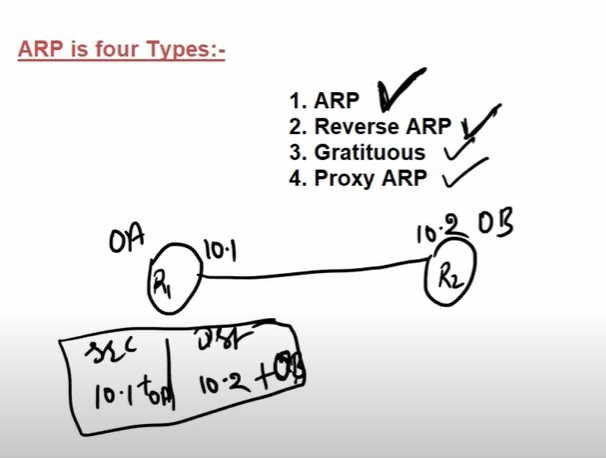
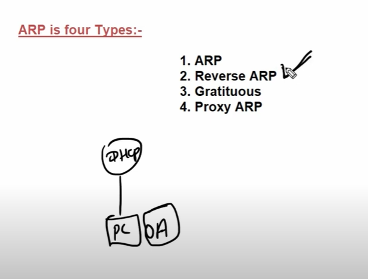
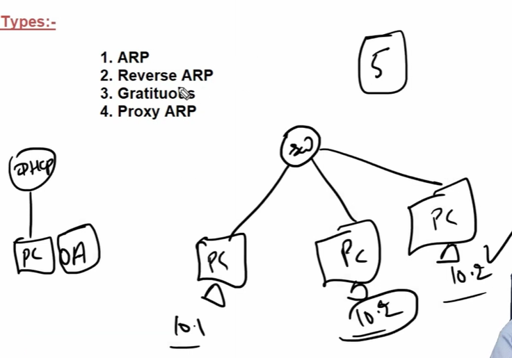
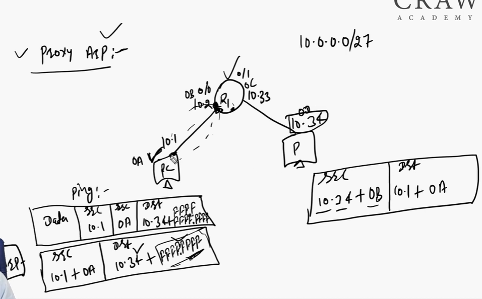

Arp is sent to get the mac adress of a particular ip

2.  Reverse arp - find ip address from dhcp on behalf of mac address

Gratitous arp find if there is another device on the network with same ip address or not
- To check duplicate ip in the network

Proxy arp
Arp packets do not go on different networks
When sending to a pc (10.34) on different network ,
The reply is from the router in between , which adds its mac address in behalf of the device on the routers network
