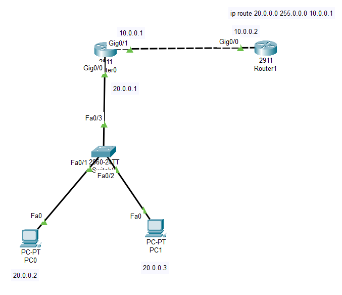
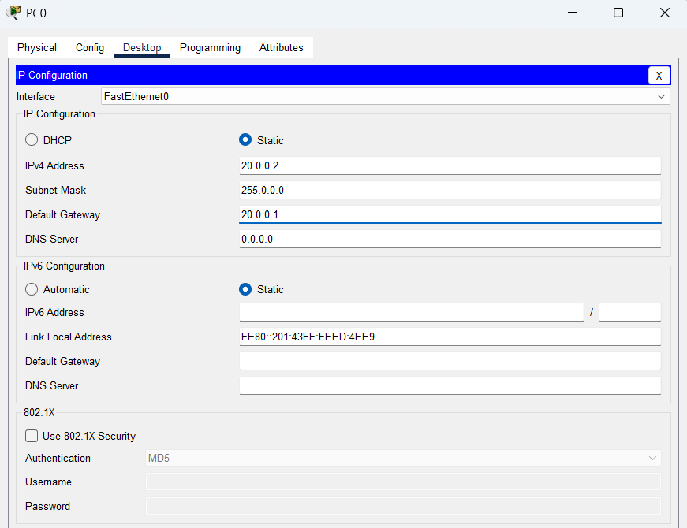
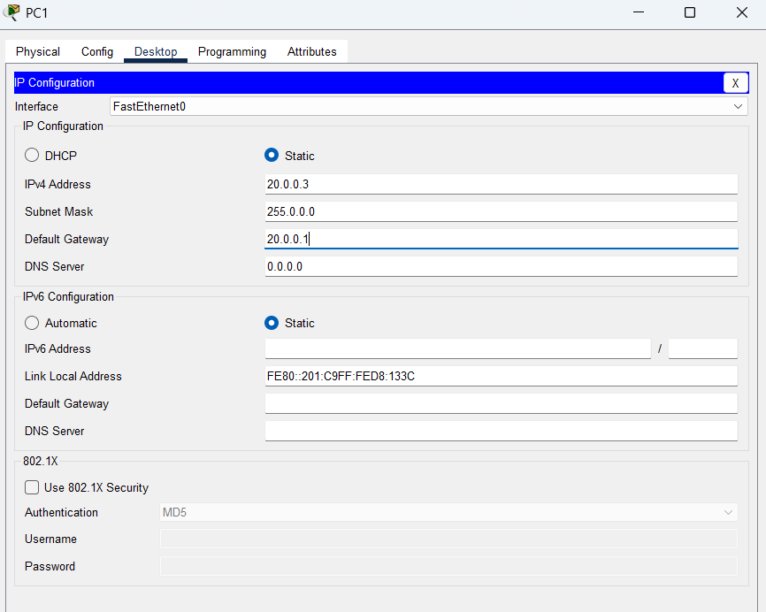
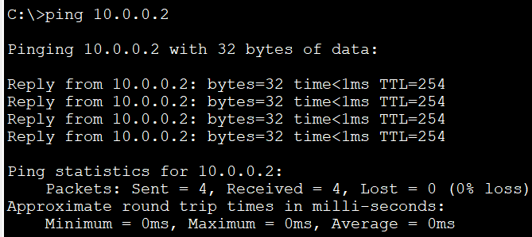

# 
# Router 0

Router\>enable
Router#configure terminal
Router(config)#interface gigabitEthernet 0/0
Router(config-if)#ip address 20.0.0.1 255.0.0.0
Router(config-if)#no shutdown
Router(config-if)#ex

Router(config)#
Router(config)#interface gigabitEthernet 0/1
Router(config-if)#ip address 10.0.0.1 255.0.0.0
Router(config-if)#no shutdown
# 
# Router 1 
# 
Router\>enable
Router#configure terminal
Router(config)#interface gigabitEthernet 0/0
Router(config-if)#ip address 10.0.0.2 255.0.0.0
Router(config-if)#no shutdown

Router(config)#ip route 20.0.0.0 255.0.0.0 10.0.0.1
# 
# Pc 0 

Set default gateway too
Which the ip of router of your network connecting the other network

# 
# 
# Pc 1

