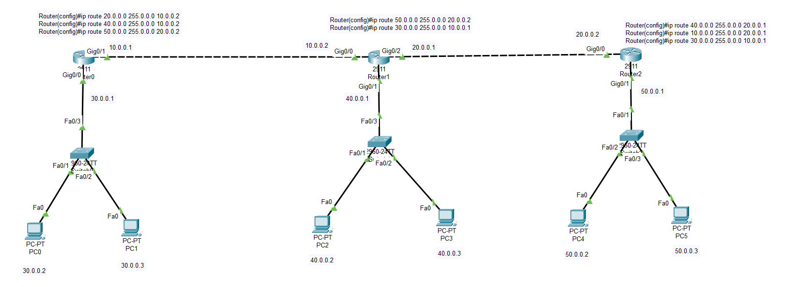
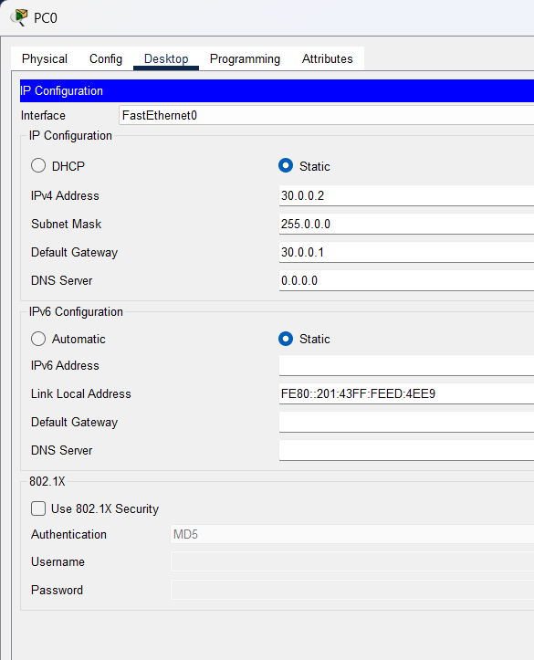
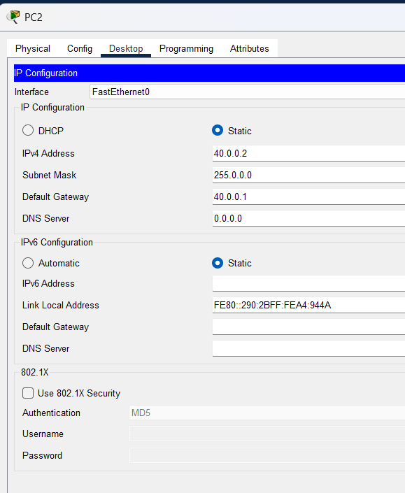
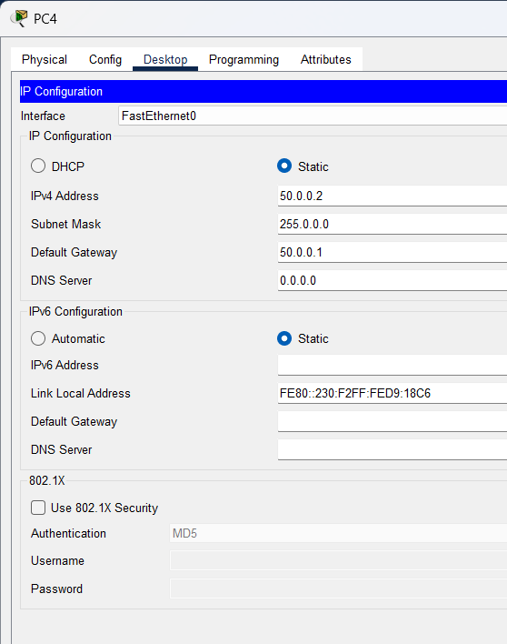

Router 0

Router\>enable
Router#configure terminal
Router(config)#interface gigabitEthernet 0/1
Router(config-if)#ip address 10.0.0.1 255.0.0.0
Router(config-if)#no shutdown
Router(config-if)#ex

Router(config)#interface gigabitEthernet 0/0
Router(config-if)#ip address 30.0.0.1 255.0.0.0
Router(config-if)#no shutdown
Router(config-if)#ex

Router(config)#ip route 20.0.0.0 255.0.0.0 10.0.0.2
Router(config)#ip route 40.0.0.0 255.0.0.0 10.0.0.2
Router(config)#ip route 50.0.0.0 255.0.0.0 20.0.0.2

Router 1

Router\>enable
Router#configure terminal
Router(config)#interface gigabitEthernet 0/0
Router(config-if)#ip address 10.0.0.2 255.0.0.0
Router(config-if)#no shutdown
Router(config-if)#ex

Router(config)#interface gigabitEthernet 0/2
Router(config-if)#ip address 20.0.0.1 255.0.0.0
Router(config-if)#no shutdown
Router(config-if)#ex
Router(config)#interface gigabitEthernet 0/1
Router(config-if)#ip address 40.0.0.1 255.0.0.0
Router(config-if)#no shutdown
Router(config-if)#ex

Router(config)#ip route 50.0.0.0 255.0.0.0 20.0.0.2
Router(config)#ip route 30.0.0.0 255.0.0.0 10.0.0.1

Router 2

Router\>enable
Router#configure terminal
Router(config)#interface gigabitEthernet 0/0
Router(config-if)#ip address 20.0.0.2 255.0.0.0
Router(config-if)#no shutdown
Router(config-if)#ex
Router(config)#interface gigabitEthernet 0/1
Router(config-if)#
Router(config-if)#ip address 50.0.0.1 255.0.0.0
Router(config-if)#no shutdown

Router(config-if)#ip route 40.0.0.0 255.0.0.0 20.0.0.1
Router(config)#ip route 40.0.0.0 255.0.0.0 20.0.0.1
Router(config)#ip route 10.0.0.0 255.0.0.0 20.0.0.1
Router(config)#ip route 30.0.0.0 255.0.0.0 10.0.0.1

