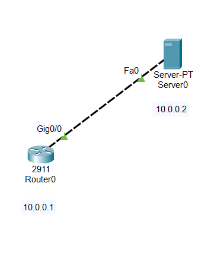
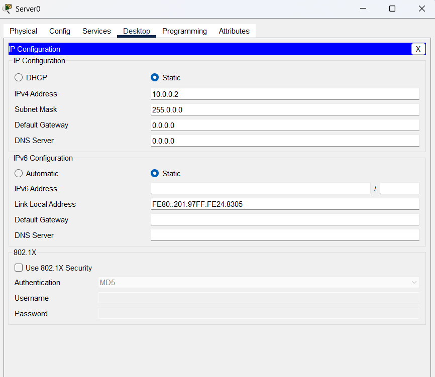
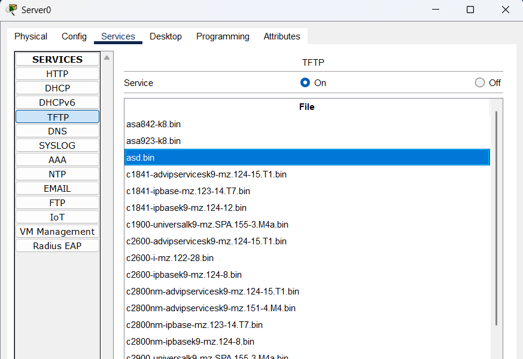
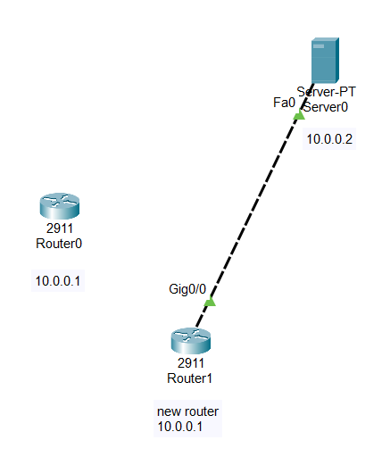
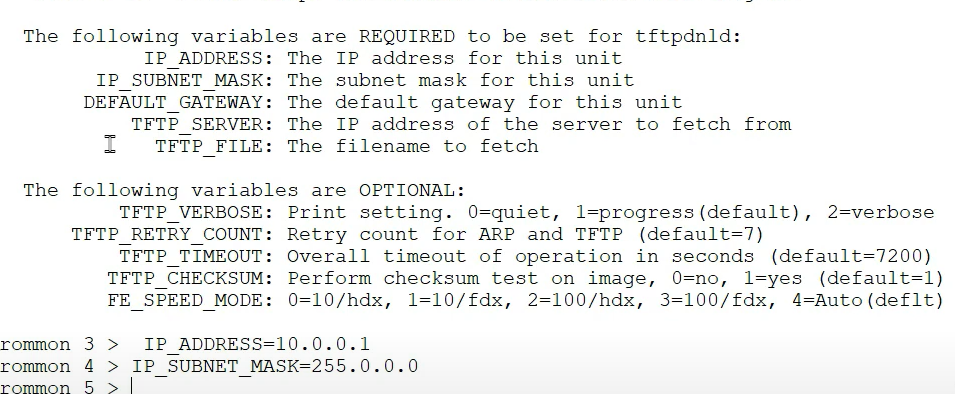
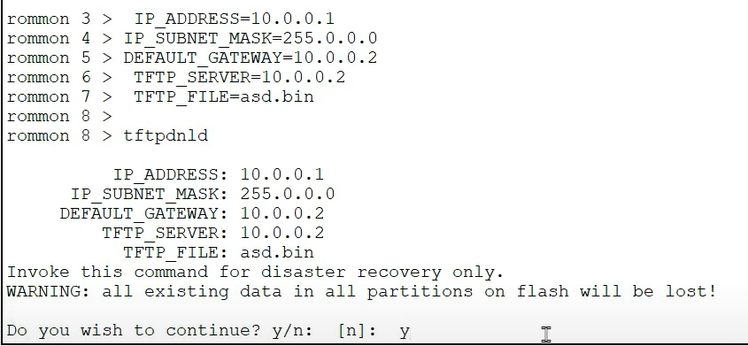
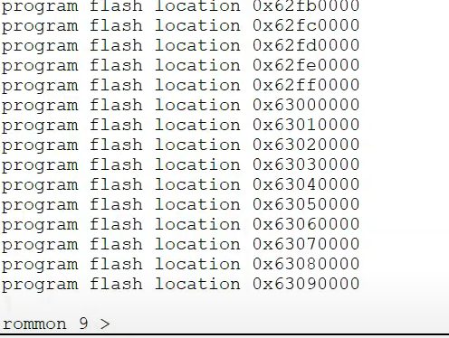
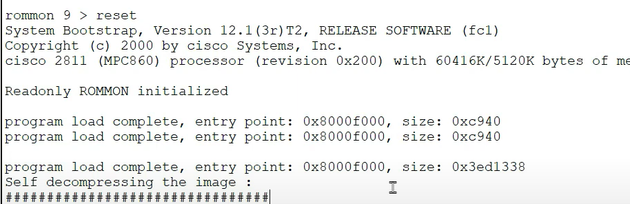
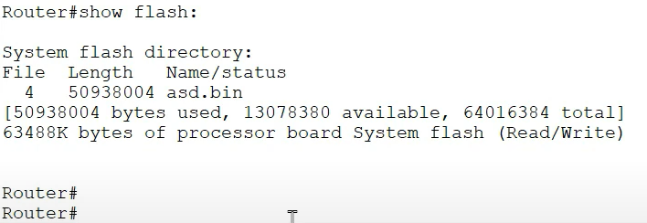

BIN IS THE FORMAT
IOS FILES ARE IN BIN FORMAT

Router\>
Router\>enable
Router#configure terminal
Router(config)#interface gigabitEthernet 0/0
Router(config-if)#ip address 10.0.0.1 255.0.0.0
Router(config-if)#no shutdown

Router\>enable
Router#show flash:

System flash directory:
File Length Name/status
3 33591768 c2900-universalk9-mz.SPA.151-4.M4.bin
2 28282 sigdef-category.xml
1 227537 sigdef-default.xml
\[33847587 bytes used, 221896413 available, 255744000 total\]
249856K bytes of processor board System flash (Read/Write)

Router#copy flash: tftp:
Source filename \[\]? c2900-universalk9-mz.SPA.151-4.M4.bin
Address or name of remote host \[\]? 10.0.0.2
Destination filename \[c2900-universalk9-mz.SPA.151-4.M4.bin\]? asd.bin

Writing c2900-universalk9-mz.SPA.151-4.M4.bin....!!!!!!!!!!!!!!!!!!!!!!!!!!!!!!!!!!!!!!!!!!!!!!!!!!!!!!!!!!!!!!!!!!!!!!!!!!!!!!!!!!!!!!!!!!!!!!!!!!!!!!!!!!!!!!!!!!!!!!!!!!!!!!!!!!!!!!!!!!!!!!!!!!!!!!!!!!!!!!!!!!!!!!!!!!!!!!!!!!!!!!!!!!!!!!!!!!!!!!!!!!!!!!!!!!!!!!!!!!!!!!!!!!!!!!!!!!!!!!!!!!!!!!!!!!!!!!!!!!!!!!!!!!!!!!!!!!!!!!!!!!!!!!!!!!!!!!!!!!!!!!!!!!!!!!!!!!!!!!!!!!!!!!!!!!!!!!!!!!!!!!!!!!!!!!!!!!!!!!!!!!!!!!!!!!!!!!!!!!!!!!!!!!!!!!!!!!!!!!!!!!!!!!!!!!!!!!!!!!!!!!!!!!!!!!!!!!!!!!!!!!!!!!!!!!!!!!!!!!!!!!!!!!!!!!!!!!!!!!!!!!!!!!!!!!!!!!!!!!!!!!!!!!!!!!!!!!!!!!!!!!!!!!!!!!!!!!!!!!!!!!!!!!!!!!!!!!!!!!!!!!!!!!!!!!!!!!!!!!!!!!!!!!!!!!!!!!!!!!!!!!!!!!!!!!!!!!!!!!!!!!!!!!!!!!!!!!!!!!!!!!!!!!!!!!!!!!!!!!
\[OK - 33591768 bytes\]

33591768 bytes copied in 3.308 secs (1066202 bytes/sec)
Router#

NEW ROUTER INSTALLED

Router\>enable
Router#configure terminal
Router(config)#interface gigabitEthernet 0/0
Router(config-if)#ip address 10.0.0.1 255.0.0.0
Router(config-if)#no shutdown
Router(config)#ex
Router#

Router#show flash:

System flash directory:
File Length Name/status
3 33591768 c2900-universalk9-mz.SPA.151-4.M4.bin
2 28282 sigdef-category.xml
1 227537 sigdef-default.xml
\[33847587 bytes used, 221896413 available, 255744000 total\]
249856K bytes of processor board System flash (Read/Write)

Router#delete flash:
Delete filename \[\]?c2900-universalk9-mz.SPA.151-4.M4.bin
Delete flash:/c2900-universalk9-mz.SPA.151-4.M4.bin? \[confirm\]

Router#show flash:

System flash directory:
File Length Name/status
2 28282 sigdef-category.xml
1 227537 sigdef-default.xml
\[255819 bytes used, 255488181 available, 255744000 total\]
249856K bytes of processor board System flash (Read/Write)

Router#
Router#reload
System configuration has been modified. Save? \[yes/no\]:yes
Proceed with reload? \[confirm\]
Boot process failed...

The system is unable to boot automatically. The BOOT
environment variable needs to be set to a bootable
image.
rommon 1 \>

THE DEVICE NOE COMES TO ROMMON MODE
I.E. ENTERS THE BOOT MENU NOW
BIOS

"tftpdnld" is a command used in Cisco routers and switches to download and load a new Cisco IOS image or configuration file using TFTP (Trivial File Transfer Protocol). It is primarily used in ROMmon mode (ROM Monitor mode) when the router's IOS is missing, corrupted, or needs to be upgraded.

In "tftpdnld", the "dnld" stands for "download."

So, the command essentially means:
"TFTP Download."

It tells the Cisco device to download a file (usually an IOS image) from a TFTP server and load it into flash memory.

