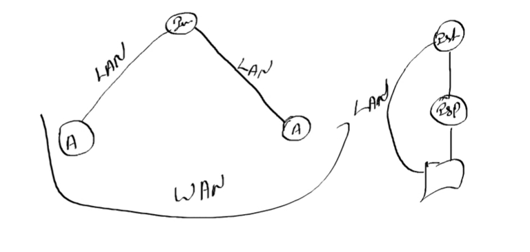
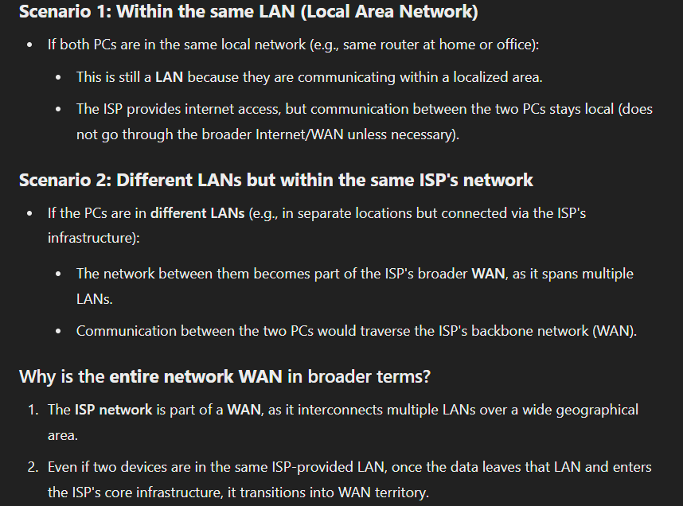
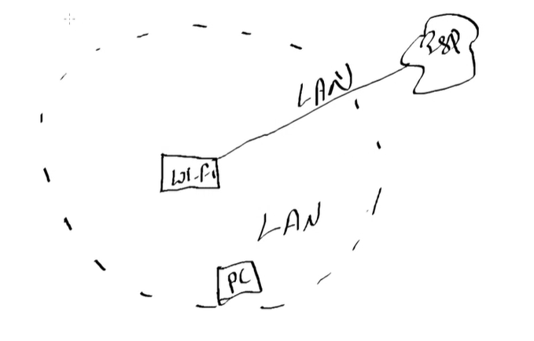

Unicast - Unicast is a one-to-one connection that establishes a direct line of communication between two devices. It's similar to sending an email to a friend.
Multicast - Multicast is a method of group communication where the sender sends data to multiple receivers or nodes present in the network simultaneously.
Broadcast - one to many conversations . Ex, television

Simplex - A one-way communication mode where only one device can send data while the other receives. This is similar to a one-way street.
Half duplex - A two-way communication mode where data can flow in both directions, but not at the same time. One device sends data, and then the other receives it. This is sometimes called two-way alternate.
Full duplex - A two-way communication mode where data can flow in both directions simultaneously. This is similar to a telephone line, although people often use half-duplex to listen to the other person.

# Network types 

On the basis of

## Participation 
1.  Private - only an authorized person can access
2.  Public - anyone can access

## Area
There are only 2 , rest are just different names of it
1.  Lan (main)
2.  Wan (main)
3.  Can - Campus Area Network : A network that spans a campus or a limited geographical area, often connecting various buildings within an organization like a university or corporate office.
4.  Man - Metropolitan Area Network : A network designed to cover a city or metropolitan area, typically larger than a LAN (Local Area Network) but smaller than a WAN (Wide Area Network).
5.  Van - Value-Added Network : A private network provider that offers specialized services, such as secure data transmission, EDI (Electronic Data Interchange), or managed network solutions.
6.  Han - Home Area Network : A network within a home environment connecting devices like computers, printers, smartphones, IoT devices, and smart home systems.
7.  Dan - Desk Area Network : A localized network connecting devices within a desk or workspace. This is less commonly used compared to other terms.
8.  Pan - Personal Area Network : A network used for communication among devices close to an individual, such as Bluetooth-connected devices, wearables, or USB connections.
9.  San - Storage Area Network : A high-speed specialized network that provides access to consolidated storage devices, commonly used in enterprise data centers for data storage and retrieval.

## Lan (local area network)
Distance doesn’t matter
Ex. If 2 computers are connected through cable over a very long distance

## Wan (wide area network)
If its uploaded on cloud

Why does connection decrease when weather is bad
What is peer

Softwares used :
Ccna - cisco packet tracer
Ccnp - gns3
Ccie - eve

Questions

Hypothetical :
We connect with instagram over lan
Since the isp is not coming in between

Wifi to pc is lan
But overall the connection is wan , if we consider isp , wifi and pc
Since isp gives wired connection to router and it creates a local network for us

Wan
Even though everything is connected on wires
The wifi still creates a local network for us
The pc is connected through lan cable or ethernet

