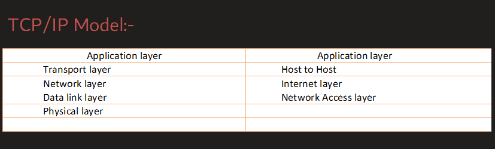

OSI model is a reference model and TCP/IP model is a practically implemented model

ISO created a 7 layer model in 1984

But DOD directly gave the practical implementation of TCP/IP model
So it got implemented everywhere

OSI has 7 layer

Dod did not give any theory for its model

But researchers say 4/5 layers

Theoretically layers of tcp/ip model
