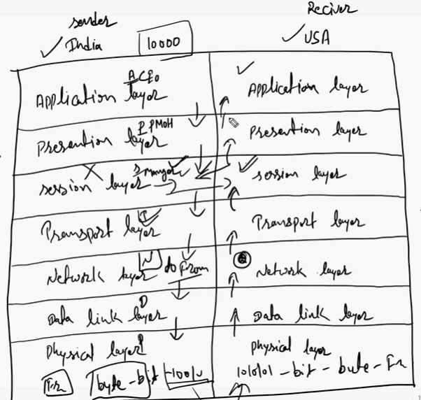
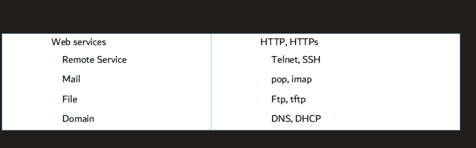
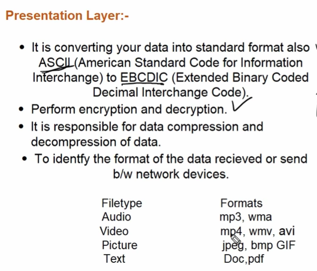
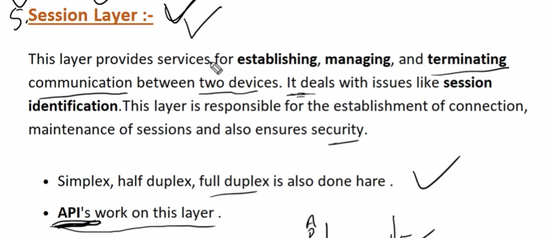
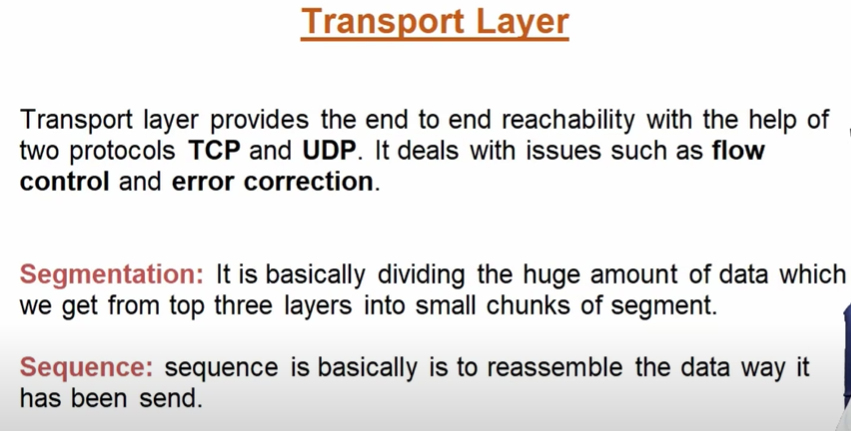
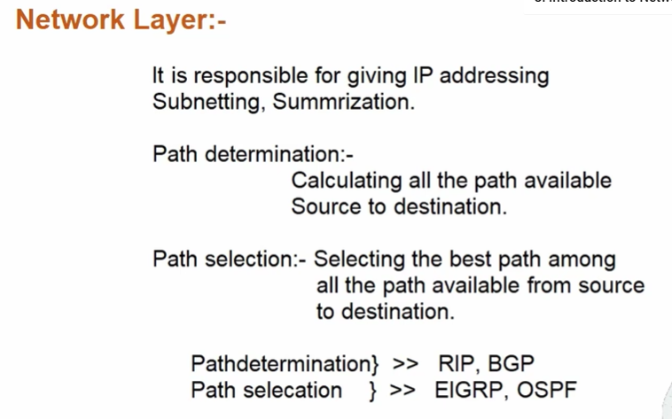
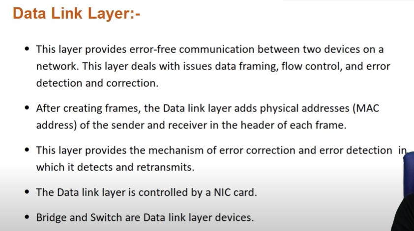
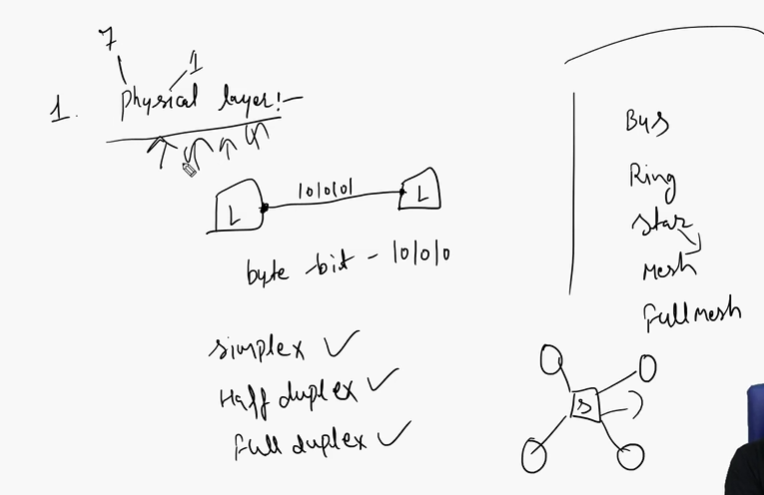

Tcp/ip model has 4/5 layers

Encryption and decryption is allowed in presentation layer

When sending it is called segmentation - encapsulation
When receiving - fragmentation - decapsulation

# Application Layer

It provide you user interface.
It is provided you set of protocols to get connected with actual applications.

It decides modes of communication.

Note: Above mentioned three layer develop by software engineer.

All the physical connection of devices
And all the topologies are in physical layer

