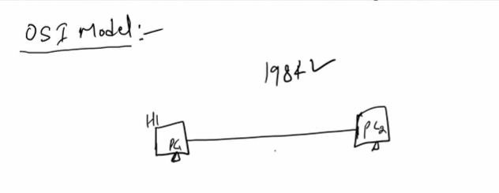
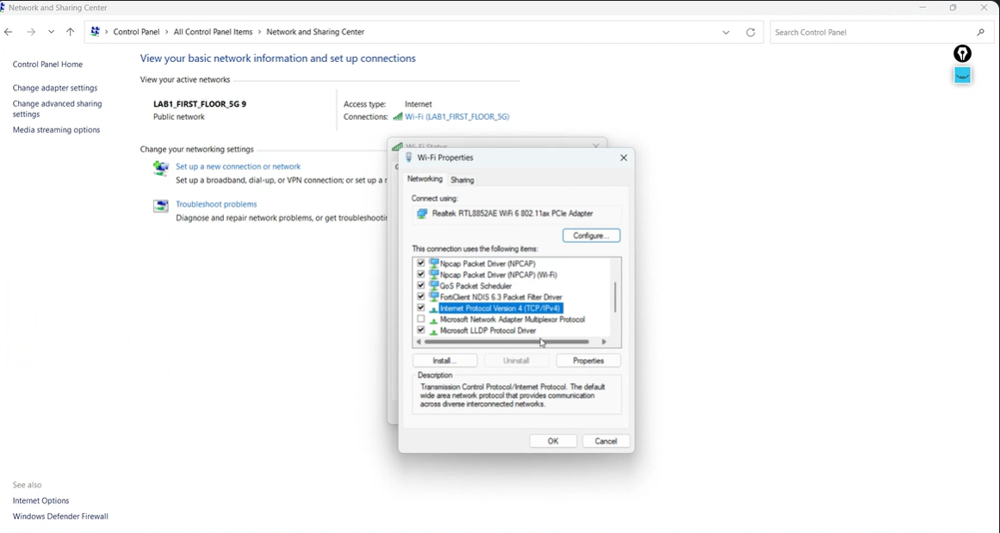
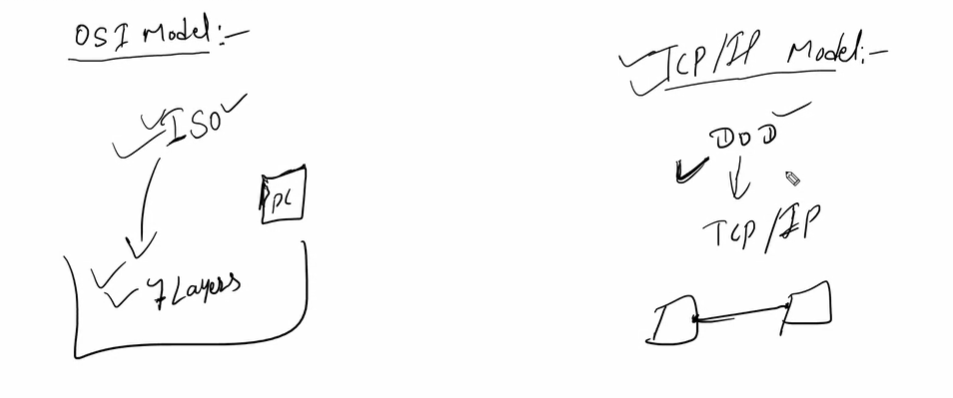
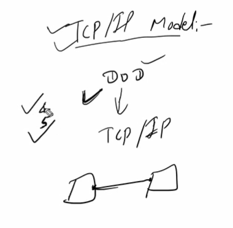

Connects 2 different devices

Before 1984
Devices needed to be from same vendor/manufacturer to connect
To eliminate is problem , osi model was implemented

ISO Came forward
Introduced 7 layers to connect 2 devices

Osi model is nowhere practicaly implemented

Tcp/ip model is practically implemented

Before iso could introduce osi practically
Dod introduces tcp/ip model practically
Department of defense (usa)

OSI Model
OSI stands for Open system interconnection. It is a reference model to communicate over the network. It was developed by ISO 1984. OSI model give us a standard protocol to communicate over the network.

Why we need OSI model
To provide intermobility between two different vendor devices.

