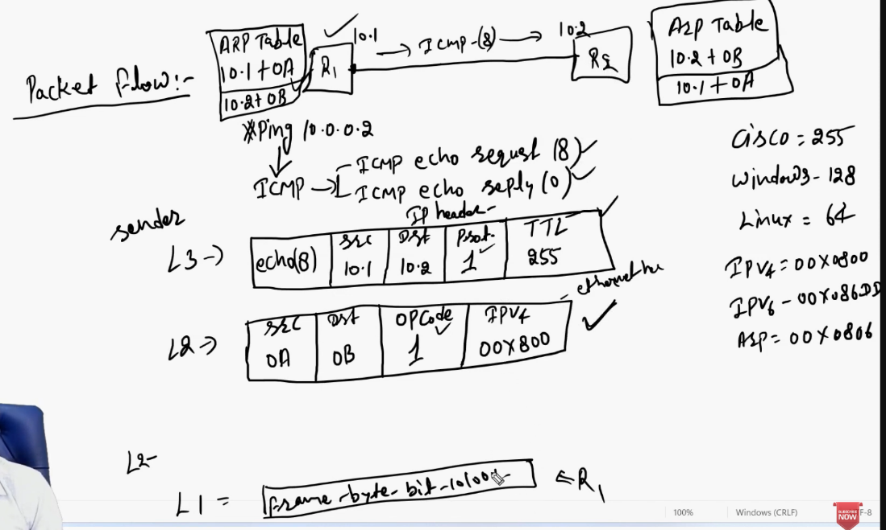

Ping is a command used to verify connectivity between source to destination

Icmp protocol value - 1

TTL values
Cisco devices - 255
Windows - 128
Linux - 64

Type code
Ipv4 00x0800
Ipv6 00x086d5
Arp 00x0806

