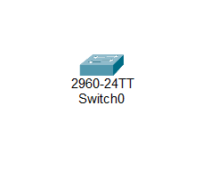
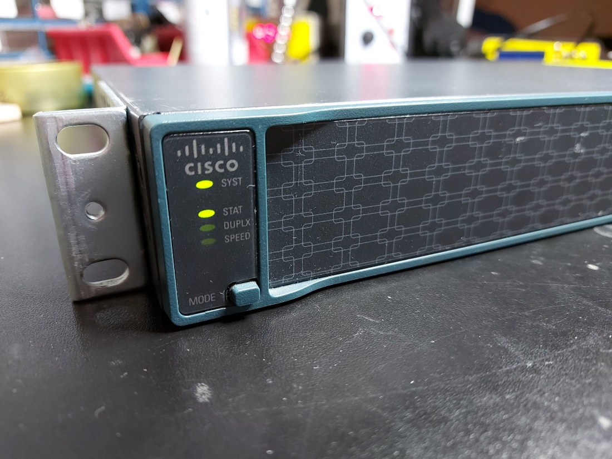
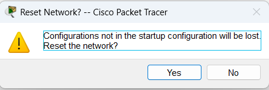
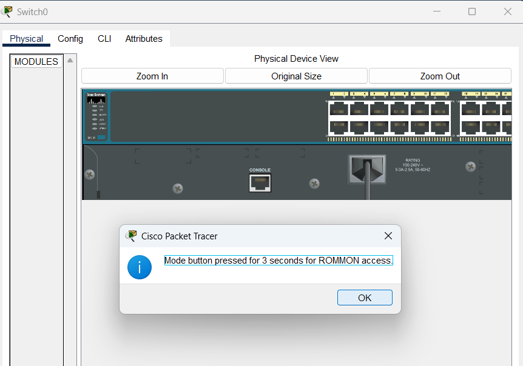
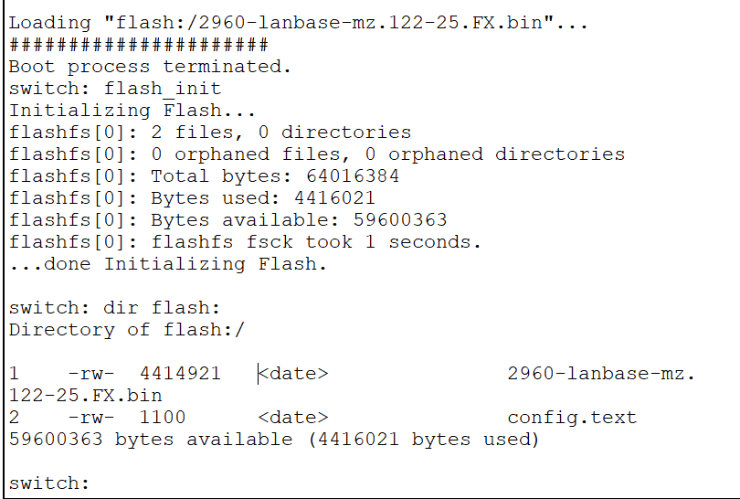
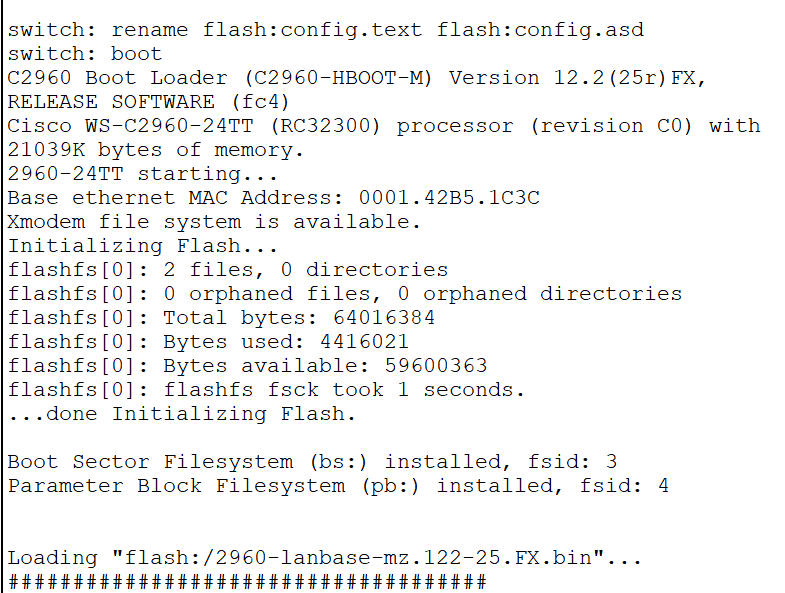
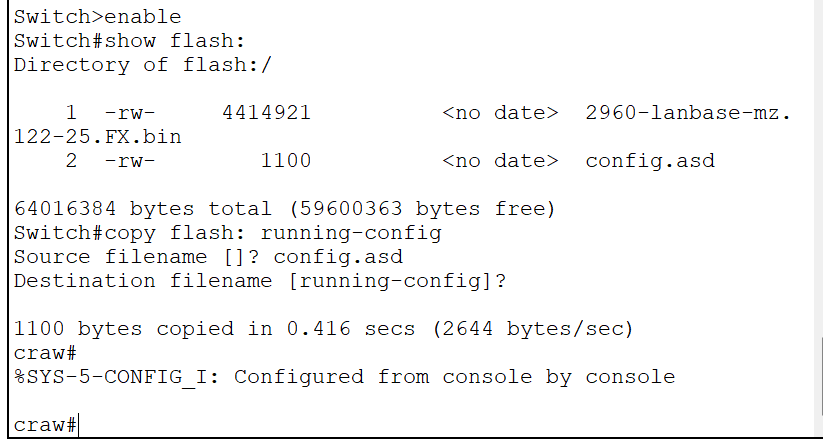

Switch\>
Switch\>enable
Switch#configure terminal
Switch(config)#enable password 123
Switch(config)#hostname craw
craw(config)#ex
craw#
craw#wr
Building configuration...
\[OK\]
craw#
craw#ex

craw\>
craw\>enable
Password:

Now asks for password

We press the mode button physically present

On cisco packet tracer , we reset the network

And press the mode button

switch: flash_init
switch: dir flash:

switch: rename flash:config.text flash:config.asd
switch: boot

We rename the config file which had the passwords in it

Switch\>enable
Switch#show flash:
Directory of flash:/

1 -rw- 4414921 \<no date\> 2960-lanbase-mz.122-25.FX.bin
2 -rw- 1100 \<no date\> config.asd

64016384 bytes total (59600363 bytes free)
Switch#copy flash: running-config
Source filename \[\]? config.asd
Destination filename \[running-config\]?

1100 bytes copied in 0.416 secs (2644 bytes/sec)
craw#
%SYS-5-CONFIG_I: Configured from console by console

craw#

All the previous configuration like hostname has come back

We can set new password now

To delete a flash

Switch# Delete flash:

