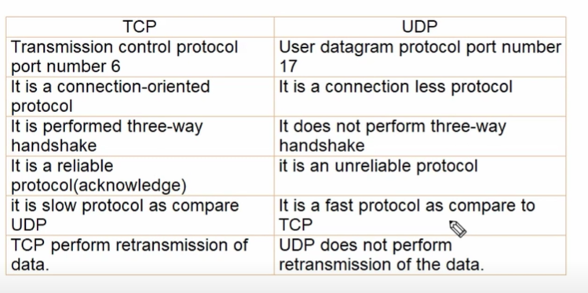

Tcp is a slow protocol since connection is established there

In tcp till the time connection is established , the packet is being forwarded

In udp , packet is forwarded only once
If the connection is established , then good
Otherwise it won't sent again

