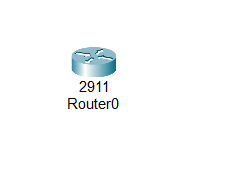
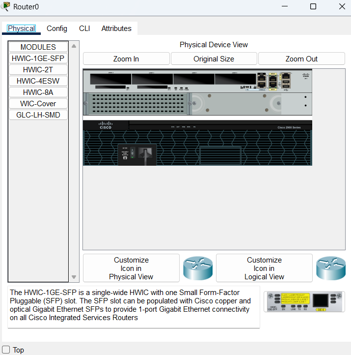
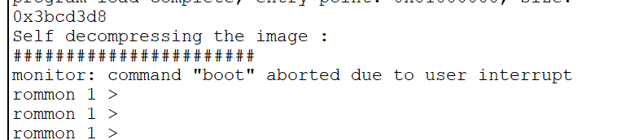
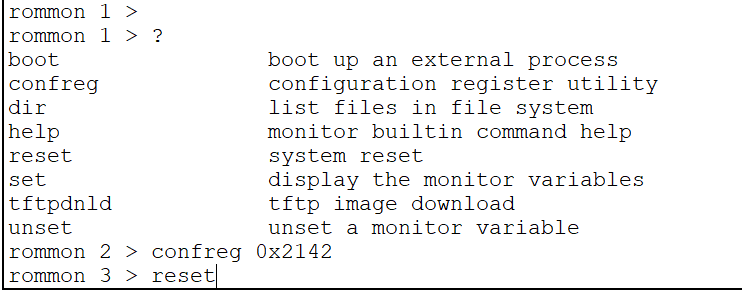
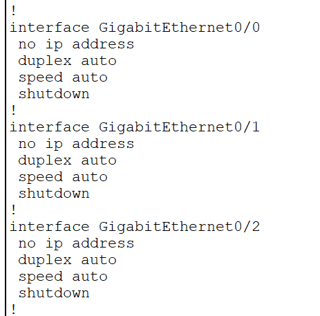
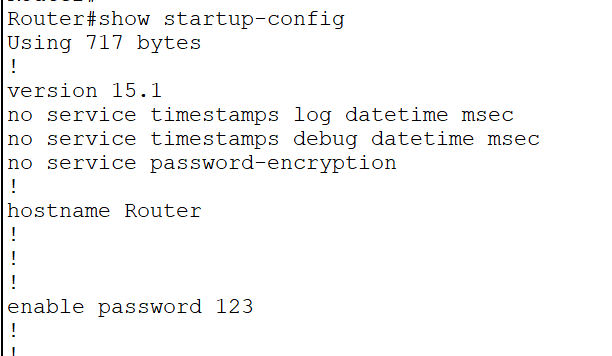
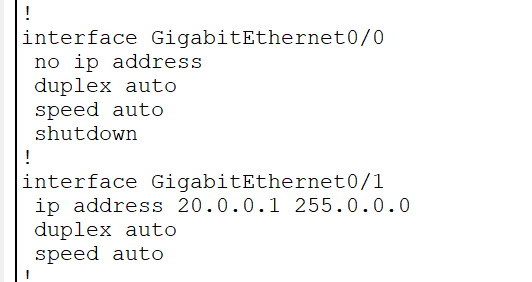
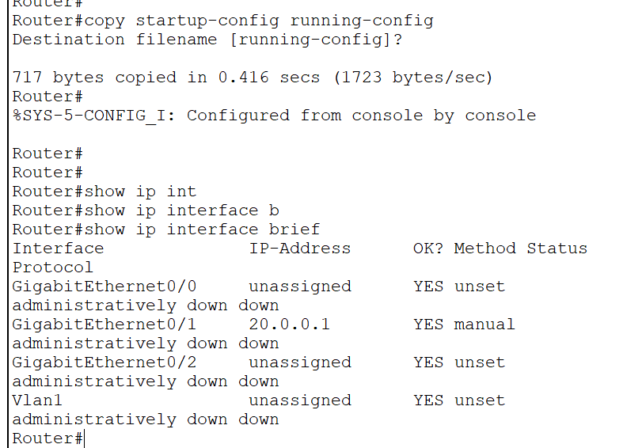

Router\>enable
Router#configure terminal
Router(config)#interface gigabitEthernet 0/1
Router(config-if)#ip address 20.0.0.1 255.0.0.0
Router(config-if)#no shutdown
Router(config-if)#ex
Router(config)#
Router(config)#enable password 123
Router(config)#ex
Router#
Router#wr
Building configuration...
\[OK\]
Router#

Turn off the router physically and then turn it on
When decompressing image ,
Press ctrl+c
To enter romon mode

The configuration code by default is 2102
We change it so that the startup configurations are not read , when booting up

Router\>enable
Router#show run
Router#show running-config

All our configuration has been shifted to startup-config instead of running-config

Now the startup-config commands are saved to running-config

Router#copy startup-config running-config

