Local Area Network (LAN)
■ Can use WiFi (IEEE 802.11) or Ethernet (IEEE 802.3)

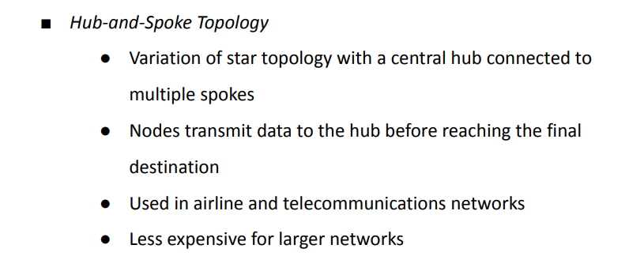

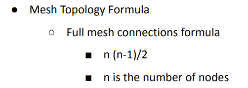

Two types
○ Full mesh – every node connected to every other
○ Partial mesh – some nodes fully interconnected, others
connected to one or two devices

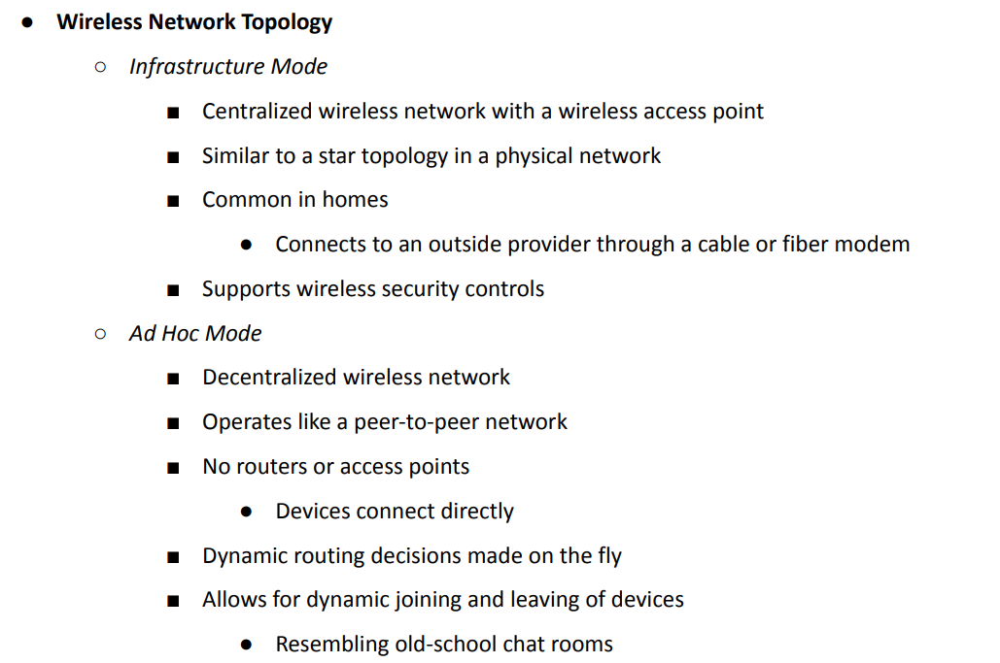

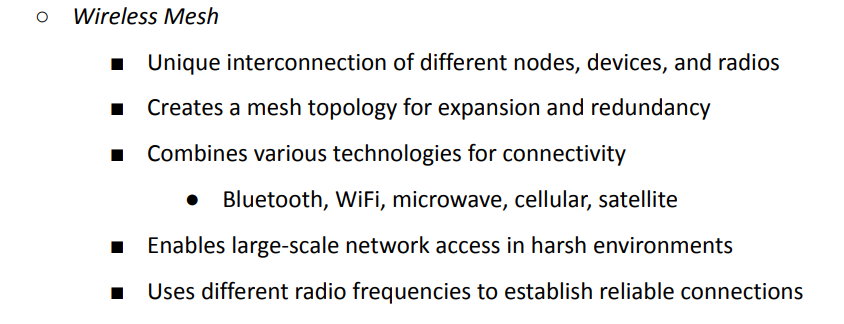

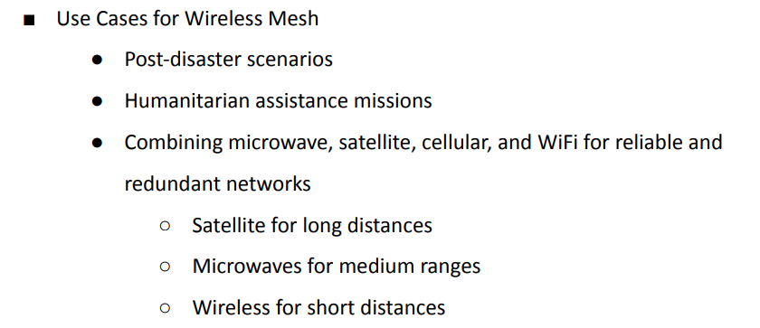

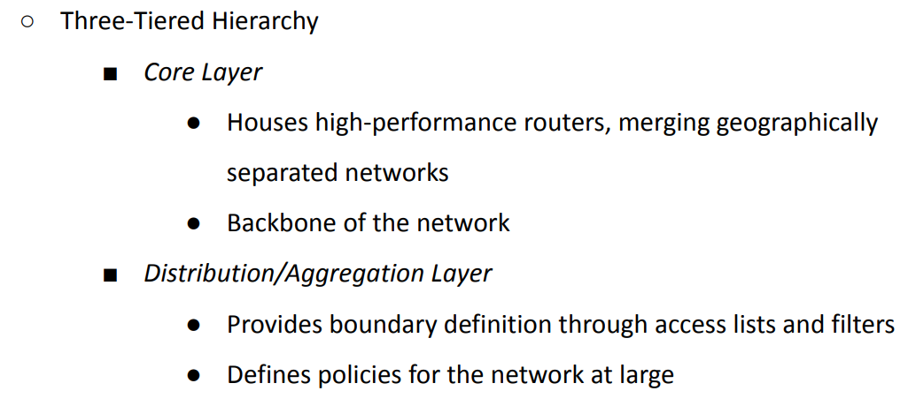

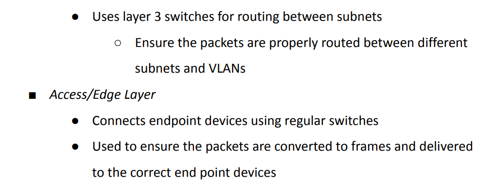

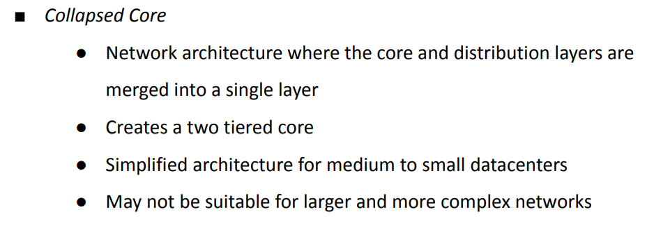

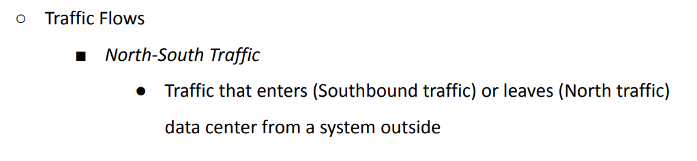

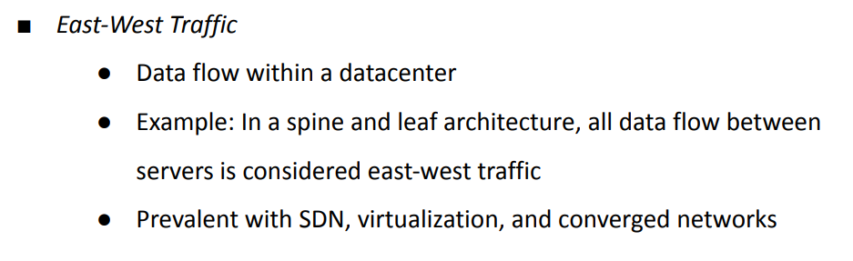

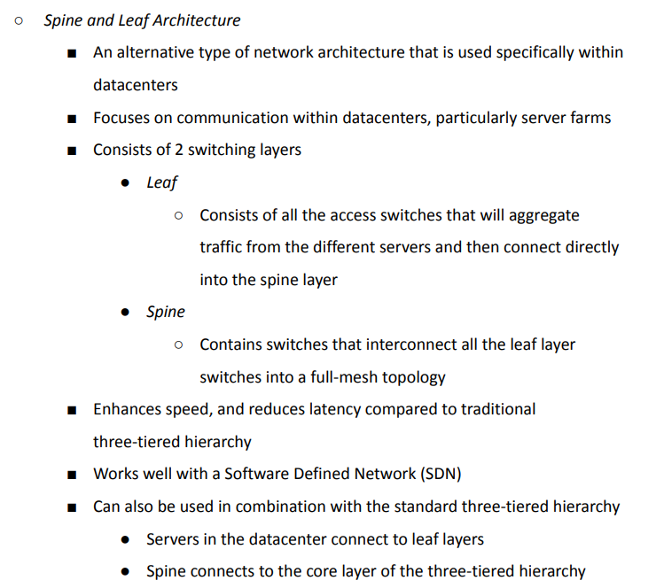

