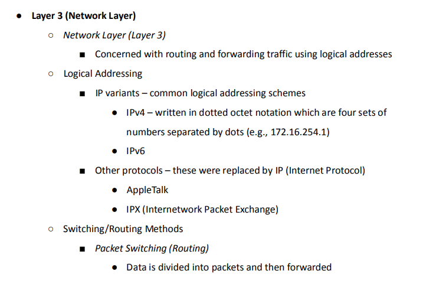
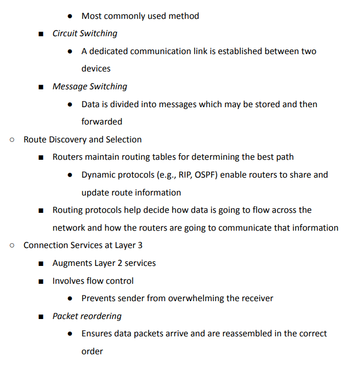

Open system interconnection model

● Layer 1 (Physical)

■ Switching between levels to represent 1 or 0
● Copper Wire (Cat5/Cat6) – Uses voltage (0V for 0, +5V/-5V for 1)
● Fiber Optic Cable – Uses light (on for 1, off for 0)

○ Layer 1 Devices

■ Cables – media
● Fiber optic
● Ethernet
● Coaxial

■ Wireless Media
● Bluetooth
● Wi-Fi
● Near field communication

■ Infrastructure Devices
● Hubs
● Access points
● Media converters

○ Layer 1 Device Characteristics
■ Simply repeat whatever they receive
■ No logic or decision-making at Layer 1

● Layer 2 (Data Link Layer)

○ Data Link Layer (Layer 2)
■ Responsible for packaging bits from Layer 1 into frames and transmitting
them across the network
■ Performs error detection and correction, identifies devices using MAC
addresses, and provides flow control

○ MAC Address (Media Access Control Address)
■ A means for identifying a device physically and allowing it to operate on a
logical topology
■ A unique 48-bit physical addressing system is assigned to every network
interface card (NIC) produced
● Written in hexadecimal numbers
● First 24 bits – identify the manufacturer
● Remaining 24 bits – identify the specific device

○ Logical Link Control (LLC)
■ Provides connection services and acknowledges message receipt,
ensuring controlled data flow
■ Most basic form of flow control
● Limits data sent by a sender and prevents receiver overwhelm
■ Uses a checksum to detect corrupted data frames

○ Synchronization Methods at Layer 2

■ Isochronous Mode
● Common reference clock
● Time slots for transmissions
● Less overhead

■ Synchronous Method
● Devices use the same clock, with beginning and ending frames,
and control characters for synchronization

■ Asynchronous
● Devices reference own clock cycles
● No strict control over communication timing

○ Layer 2 Devices
■ Network Interface Cards (NICs)
■ Bridges
■ Switches
● Intelligent use of logic to learn and send data to specific devices
based on MAC addresses

